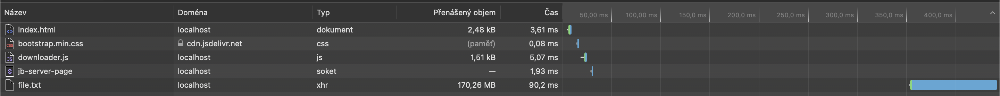

= HW2 – AJAX and XHR states

In this task, my objective was to create a simple HTML page and script, that will start downloading a large file after "Download" button click.

Image of page with the button.

Upon clicking the button, a `XMLHttpRequest` is opened and started in order to fetch the file. In this status, the button shows "Loading" and "Loaded" text _(but as it takes really little time, it is barely possible to see it)_.

image::results/2_downloading.png[width=200]
As the file is being downloaded and the request is being processed, I use the event listener on `progress` event to display information about the download.

When download finishes, the "Finished downloading" text is shown. If there was any error, there would be text "Error whilst downloading".

For successful and unsuccessful download display, I use Javascript `Promise`.

Overall screenshot of pending network requests in browser developer tools.
