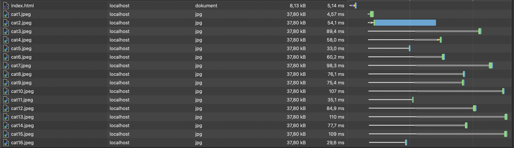
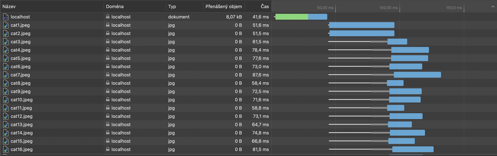

= HW6 – HTTP/2 multiplexing & push

In this task, my objective was to create two servers serving a simple webpage with hundreds of images.

First server, `http1.js` serves the images over HTTP/1.1, which results in images being loaded one after another with max count of 6 simultaneous requests.

Example of HTTP/1.1 communication, each image load has to wait because of the limitation _(6 requests)_.

The second server, `http2.js` uses advantage of HTTP/2 with the HTTP/2 push and multiplexing, so all the images can be loaded "at once" in single TCP connection.

Example of HTTP/2 communication, images are pushed, so the data are transferred at once and there is no green waiting.
