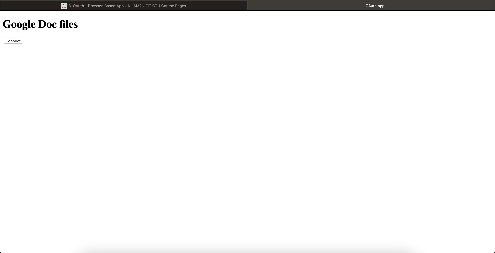
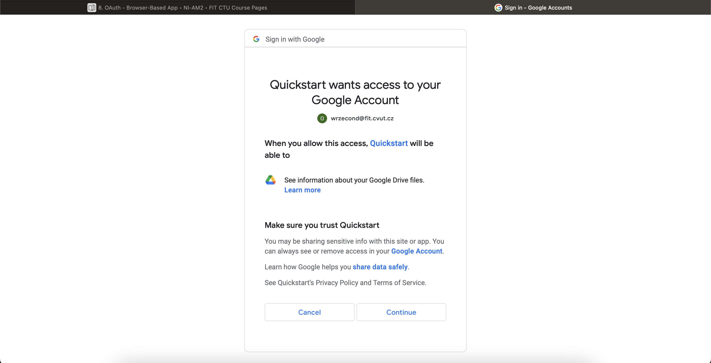
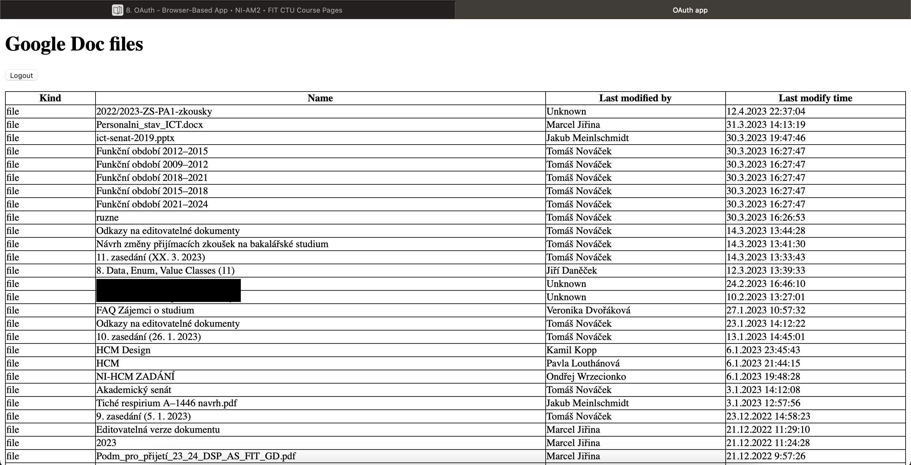
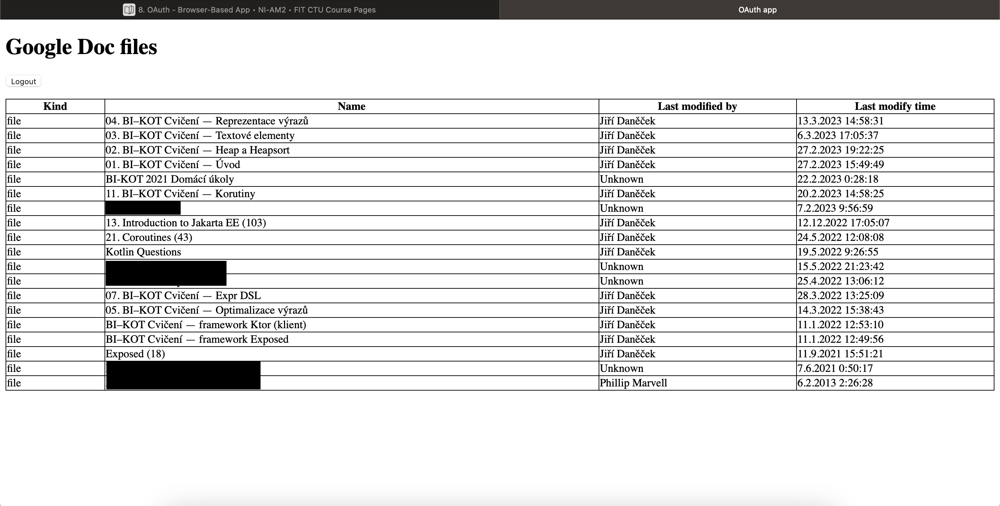

= HW8 – OAuth – browser based app

In this task, my objective was to create a simple OAuth browser based app. The application consists of a simple HTTPS Node.js server (`server.js`), which has only one function -- return `client.js` and `index.html` files.

The `index.html` file is a simple HTML document containing a logout and login buttons, paragraph for message and a table ready for *Google Drive file listing*.

== Application logic

The main logic is concentrated in `client.js`. Upon document load, the script sets up bindings for login and logout buttons and then checks, whether there is a cookie with *access token*. If so, it tries to perform a request to Google servers to *fetch data* from Google Drive API _(simple file list)_. Otherwise, it checks whether there is a `code` URL parameter. In that case, a fetch access token request is *fired* to get access token from Google API and save it in a *cookie*. If neither a cookie nor URL parameter is present, the *login* button redirecting to Google OAuth server is displayed.

== Showcase

Upon loading, the user is presented with a screen displaying *Connect* login button.

When user clicks on the Connect button, a *Google OAuth* screen is presented.

If user selects to *Continue*, he is redirected back to the page, and he sees a list of Google Drive files.

User can then log out and connect with a different account.

