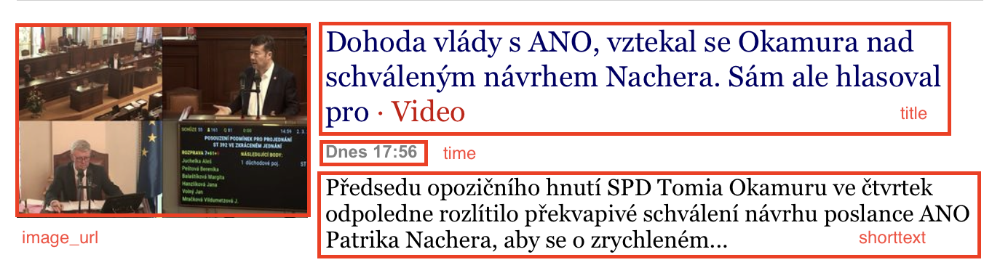

= HW1 -- Web Crawler / Scraper

== Stránka

Pro crawling jsem si vybral stránku https://novinky.cz, která obsahuje denně stovky článků z různých oblastí.

== Analýza

Když se podívám na stránku https://www.novinky.cz/robots.txt, zjistím, že nemám crawlovat stránky `/hledej`, `/emailem`, dynamické bannery, session check nebo třeba historii úprav článků. Zároveň se zde nachází odkazy na *sitemapu* pro články, novinky, sekce a tagy.

Pro svůj crawling jsem si vybral sitemapu pro sekce https://www.novinky.cz/sitemaps/sitemap_sections.xml, kde dostanu seznam všech sekcí, které můžu crawlovat.

== Návrh

Z této `sitemap_sections.xml` pomocí XPath selektoru `/urlset/url/loc/text()` získám seznam URL adres sekcí, které následně vycrawluji. Při crawlování se z článku extrahují pomocí CSS selektoru data -- název článku `title`, URL adresa obrázku `image_url`, čas publikace `time` a krátký popis `shorttext`.

_(Informace, které lze z článku extrahovat.)_

Nutno říci, že na webové stránce se nachází více typů článků, které jsou rozlišeny atributem `data-dot` u HTML elementu `<article>`. Články, které se stránkují, mají konkrétně třídu `document-item`.

Tyto články lze navíc stránkovat -- na stránce se nachází tlačítko "Zobrazit další". Crawler se tedy pokusí najít pomocí tohoto tlačítka odkaz na další stránku, kde může crawlovat.

== Spuštění

[source,shell]
----
scrapy runspider src/spider.py -o data.json
----
_(Kód pro spuštění crawleru)_

Crawler jsem spustil a nechal běžet pár minut. Výsledky jsou dostupné ve výstupním souboru `data.json`.
