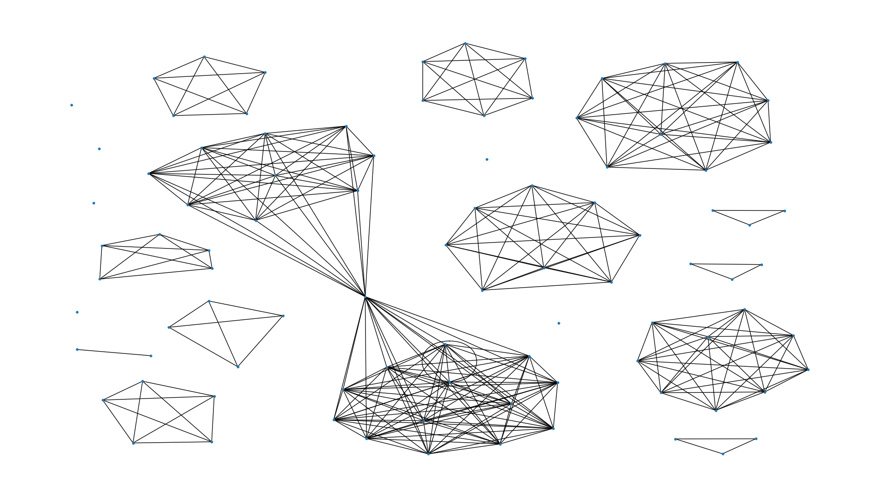
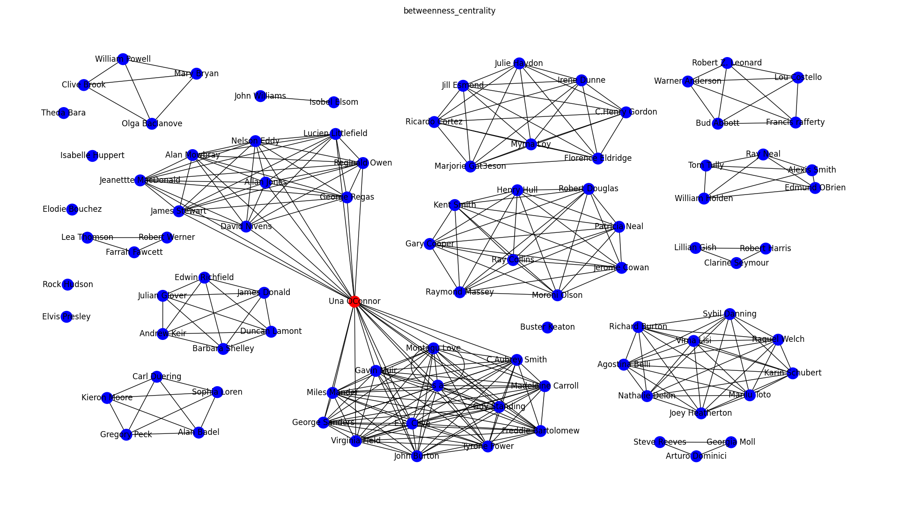
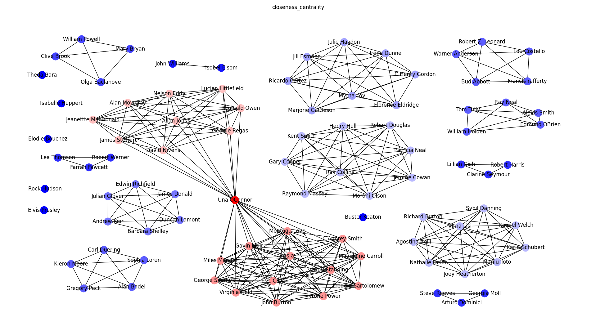
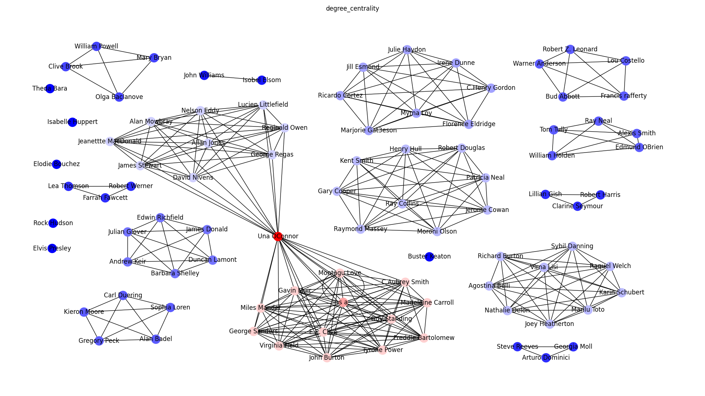
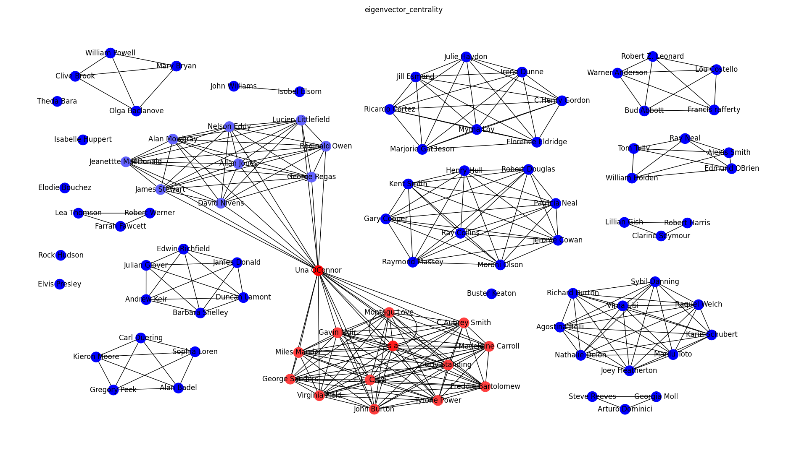
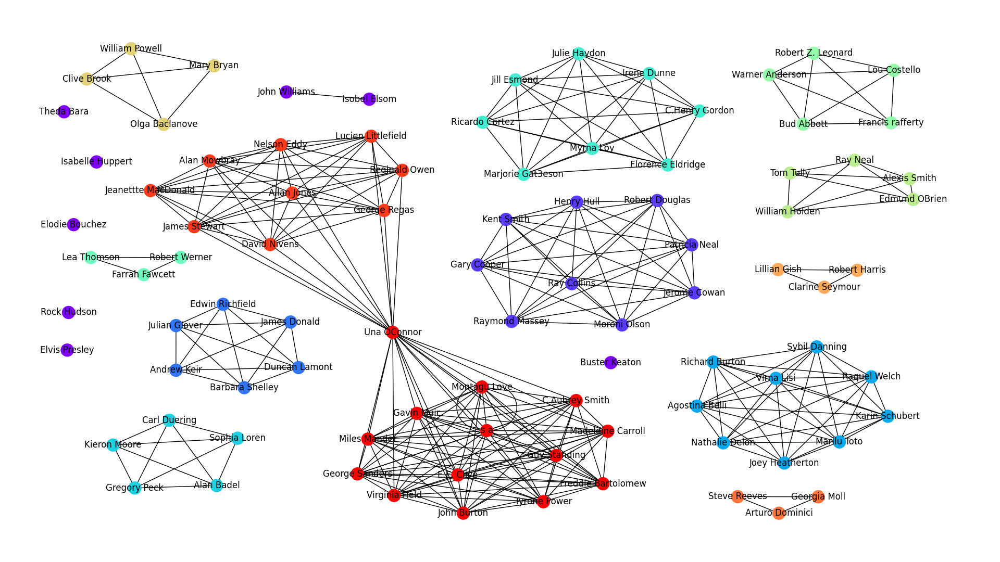
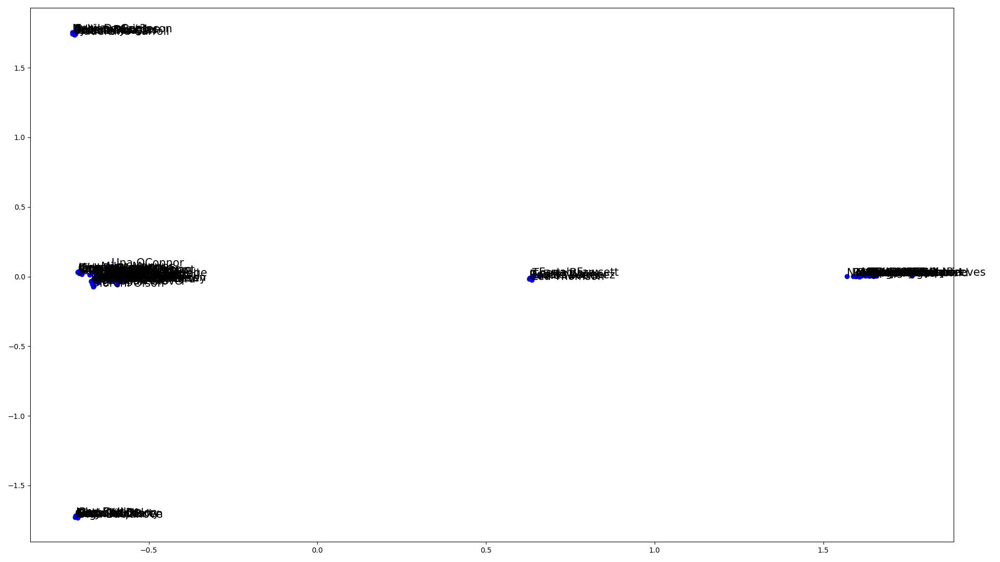

= HW3 – Social Network Analysis

V tomto úkolu bylo mým cílem analyzovat dataset – síť herců, kteří hráli v Hollywood filmech, který je dostupný v souboru `casts.csv`. Implementaci naleznete v souboru `src/analyzer.py`.

== Popis

Dataset obsažený v daném souboru obsahuje 46 234 záznamů o hercích a filmech, z důvodu rychlejšího zpracování jsem se při načítání omezil pouze na prvních 10 000 _(nastavení lze změnit parametrem row_limit ve funkci load_graph)_.

Po spuštění skriptu se nejprve zavolá funkce `print_graph_info`, která vypíše základní informace o načteném grafu:

[source,text]
----
Basic information:
Nodes     : 5832
Edges     : 30892
Density   : 0.18 %
Components: 254
----

Načtený graf tedy po odstranění duplikátních záznamů obsahuje 5 832 uzlů, 30 892 hran _(hustota je tedy podle základního vzorce pro výpočet hustoty -- počet hran / počet hran úplného grafu s 5 832 uzly 0.18 %)_ a 254 spojených komponent.

Výpis nejčastějších herců zajišťuje funkce `print_centralities`. Ta spočítá jednotlivé centrality pro všechny herce _(degree, closeness, betweenness a eigenvector)_, seřadí je a vypíše nejlepších 10 _(10 lze změnit parametrem `top_k`):

[source,text]
----
Top 10 actors (degree_centrality):

s a: 0.13806
Robert Mitchum: 0.0259
Humphrey Bogart: 0.02264
Claude Rains: 0.01818
Clint Eastwood: 0.01698
Alan Hale: 0.01681
Donald Crisp: 0.01629
Richard Burton: 0.01526
Henry Stephenson: 0.01526
Bette Davis: 0.01526

Top 10 actors (closeness_centrality):

s a: 0.39694
Robert Mitchum: 0.31983
Humphrey Bogart: 0.3102
Alan Hale: 0.30932
John Garfield: 0.30879
John Carradine: 0.30788
Edward G. Robinson: 0.30771
Vincent Price: 0.3063
Bette Davis: 0.30615
Anne Baxter: 0.30257

Top 10 actors (betweenness_centrality):

s a: 0.39084
Robert Mitchum: 0.02584
Clint Eastwood: 0.01798
Humphrey Bogart: 0.01794
Buster Keaton: 0.01161
Elizabeth Taylor: 0.01097
John Carradine: 0.00991
Vanessa Redgrave: 0.00976
Alec Guiness: 0.0097
David Niven: 0.00962

Top 10 actors (eigenvector_centrality):

Robert Mitchum: 0.16901
Nina Foch: 0.15078
William Prince: 0.14874
Ralph Bellamy: 0.14837
Robert Morley: 0.14835
John Gielgud: 0.14791
Hardy Kruger: 0.14676
John RhysDavies: 0.14613
Charles Lane: 0.14597
R.G. Armstrong: 0.14592
----

Funkce `print_communities` spočítá zase nejpočetnější shluky / komunity. K tomu využívám jak Louvainův, tak k-clique algoritmy. Kompletní výpis najdete v souboru `results/out.txt`, každopádně např. největších 5 komunit má podle Louvainova algoritmu postupně 560, 473, 337, 251 a 181 prvků, zatímco podle k-clique algoritmu to je 3 080, 19, 19, 16 a 16 prvků. Jde tedy vidět, že k-clique algoritmus našel větší komunitu.

Pro výpočet `Kevin Bacon` čísla se používá funkce `print_distances`, jako herec, ke kterému se počítá vzdálenost, je zde určen Leslie Howard. Průměrná vzdálenost je 3.03, nejmenší vzdálenosti jsou 1, největší 7. Opět, kompletní výpis je v `results/out.txt`.

Dále jsem implementoval funkce `draw_components`, `draw_centralities`, `draw_communities` a `draw_embeddings` (která zkouší *embeddings*) a výsledný graf také ukládám do souboru `export.gexf`. Pro vizualizaci jsem použil pouze filmy, které obsahují "58" ve svém názvu, což dataset redukovalo na 91 uzlů a 298 hran.

== Vizualizace

Vizualizace komponent grafu. Vidíme zde pár úplných grafů _(evidentně budou představovat jednotlivé filmy)_, pár jednotlivých herců a dva úplné grafy jsou spojeny lokálním mostem, tedy jedním hercem, který hrál v obou filmech.

Vizualizace centrality *betweenness*. Je zde jasně onen lokální most, který má největší betweenness centralitu, jelikož je jediným spojením mezi dvěma filmy.

Closeness centrality

Degree centrality

Eigenvector centrality

Další centrality nejsou nijak překvapivé. U closeness jde vidět, že čím více herců hraje ve filmu, tím větší je hodnota, největší je opět u lokálního mostu. U degree i eigenvector centrality je vidět vyšší hodnota u nižší komunity (filmu), jelikož je zde více herců, tak je tímpádem i vyšší stupeň uzlů a skóre.

Vizualizace jednotlivých komunit v grafu. Odpovídá komponentám a jednotlivým filmům.

Použití embeddings pro umístění jednotlivých herců na dvourozměrnou osu podle podobnosti. Vidíme, že zde jsou jednotlivé shluky, které představují nejspíše herce ve filmech s určitým počtem herců.
