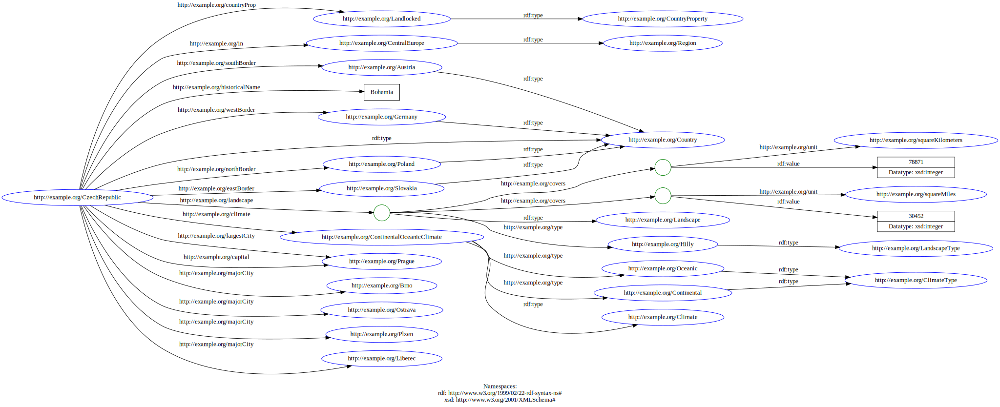

= HW1 – RDF Graph

== Task 1: Text to RDF

Mým prvním úkolem bylo vybrat nějaký odstavec z Wikipedie o alespoň 3 větách. Vybral jsem si úvodní text o **České republice** (https://en.wikipedia.org/wiki/Czech_Republic)

> The Czech Republic, or Czechia, is a landlocked country in Central Europe. Historically known as Bohemia, it is bordered by Austria to the south, Germany to the west, Poland to the northeast, and Slovakia to the southeast. The Czech Republic has a hilly landscape that covers an area of 78,871 square kilometers (30,452 sq mi) with a mostly temperate continental and oceanic climate. The capital and largest city is Prague; other major cities and urban areas include Brno, Ostrava, Plzeň and Liberec.

Graf jsem nakreslil následovně:

== Task 2: Serialize the graph

Graf jsem následně serializoval do RDF, do jednotlivých formátů. Použil jsem prefixy `rdf` pro definici `rdf:value` u hodnoty rozlohy země v různých jednotkách a `xsd` pro definici čísla _(u této rozlohy)_. Prázdný node jsem použil pro tyto jednotky a pak ještě pro krajinu. U klimatu mi připadlo vhodnější využít přímo pojmenovanou entitu, protože takovéto klima může mít i více zemí.

=== N-triples
[source,n-triples]
----
include::src/data.nl[]
----

=== Turtle
[source,turtle]
----
include::src/data.ttl[]
----

=== RDF/XML
[source,xml]
----
include::src/data.xml[]
----

=== Validation

Validaci jsem provedl pomoci nástroje `rapper`:

[source,shell]
----
kvetinac97@Thats-MacBook-Air src % rapper -q -i 'ntriples' data.nl >/dev/null; echo $?
0
kvetinac97@Thats-MacBook-Air src % rapper -q -i 'turtle' data.ttl >/dev/null; echo $?
0
kvetinac97@Thats-MacBook-Air src % rapper -q -i 'rdfxml' data.xml >/dev/null; echo $?
0
----

Dokumenty jsou validní.

== Task 3: Reification

Pro reifikaci jsem se rozhodl využít následující triplety:

[source,turtle]
----
@base <http://example.org/> .

<CzechRepublic> <northBorder> <Austria> .
<CzechRepublic> <countryProp> <Landlocked> .
<CzechRepublic> a <Country> .
----

Triplet o severní hranici jsem zvolil z důvodu, že je to poněkud nešťastně zapsáno. Ztrácíme totiž možnost hledat pouze podle hranic, ideální by bylo říct, že Česko sousedí s Rakouskem, a to na severu.

Triplet s vnitrozemskou zemí je nešťastný kvůli tomu, že se stav vnitrozemí váže k tomu, že se jedná o stát.

Triplet s tím, že se jedná o zemi volím kvůli tomu, abych dodal informaci, že se jedná o zemi, **s historickým názvem Bohemia**.

Nejprve reifikaci provedu pouze pomocí RDF:

[source,turtle]
----
@base <http://example.org/> .
@prefix rdf: <http://www.w3.org/1999/02/22-rdf-syntax-ns#> .

<border1> rdf:subject <CzechRepublic> ;
    rdf:predicate <bordersWith> ;
    rdf:object <Austria> .
<border1> <bordersOn> "North" .

<country1> rdf:subject <CzechRepublic> ;
    rdf:predicate rdf:type ;
    rdf:object <Country> .

<country1> <countryProp> <Landlocked> .
<country1> <historicalName> "Bohemia" .
----

Případně můžeme reifikovat přímo pomocí **RDF star**:

[source,turtle]
----
@base <http://example.org/> .
<< <CzechRepublic> <bordersWith> <Austria> >> <bordersOn> "North" .
<< <CzechRepublic> a <Country> >> <countryProp> <Landlocked> ;
    <historicalName> "Bohemia" .
----

