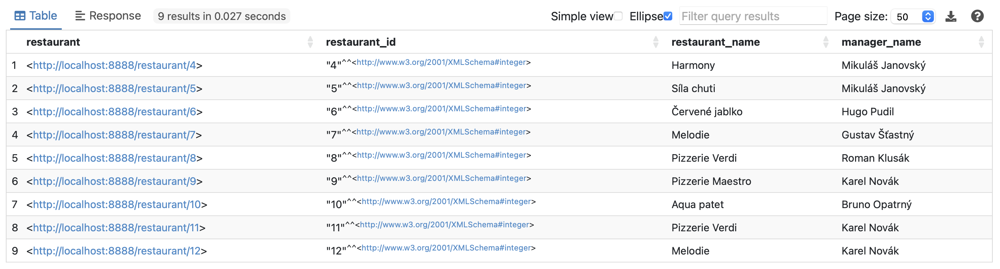
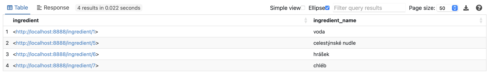
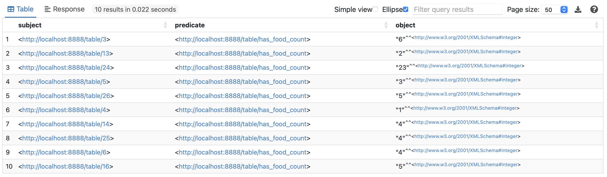
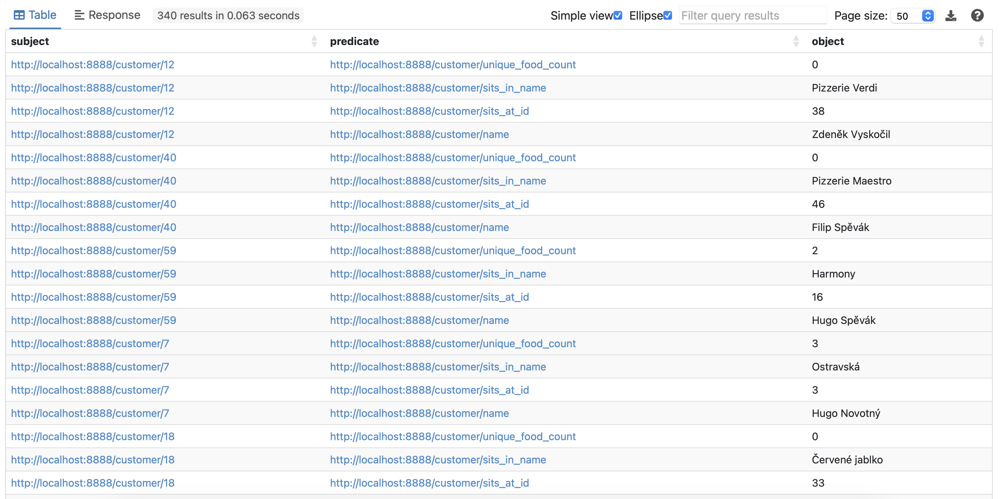
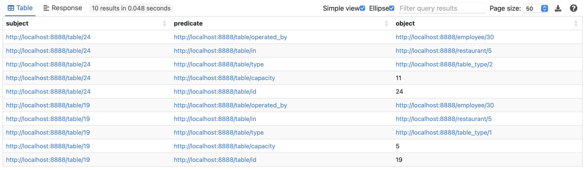

= HW3 – SPARQL

== Task 1

Prvním úkolem bylo napsat SPARQL dotazy nad nějakými RDF daty. Pro tento úkol jsem vybral data restauračního systému, která jsem vytvořil v rámci bakalářského předmětu BI-VWM. Data naleznete ve složce link:results/01/data.ttl[].

Data jsem nahrál do Apache Fuseki do datasetu `hw03` a napsal jsem na ně následující dotazy:

=== Dotaz 1

Tento dotaz má za cíl najít restaurace, jejichž manažer se **ne**jmenuje Vendelín.

Dotaz (SPARQL): link:results/01/query1.sparql[] +
Dotaz (cURL): link:results/01/query1.sh[]

Výsledek: link:results/01/query1.json[]

Použito: SELECT, FILTER, LIMIT, ORDER BY

=== Dotaz 2:

Tento dotaz slouží ke zjištění, které suroviny jsou potřeba k přípravě dvou polévek -- "Hovězí vývar s celestýnskými nudlemi" a "Hráškový krém s opečeným chlebíčkem".

Dotaz: link:results/01/query2.sparql[] +
Dotaz (cURL): link:results/01/query2.sh[]

Výsledek: link:results/01/query2.json[]

Použito: SELECT, FILER, LIMIT, DISTINCT

=== Dotaz 3:

Tento dotaz má za cíl vytvořit graf popisující, kolik jídel je objednáno na kterém stole.

Dotaz: link:results/01/query3.sparql[] +
Dotaz (cURL): link:results/01/query3.sh[]

Výsledek: link:results/01/query3.ttl[]

Použito: CONSTRUCT, LIMIT, OFFSET

=== Dotaz 4:

V tomto dotazu vytvářím graf zákazník :má_jméno jméno, :sedí_u číslo stolu, :sedí_v jméno restaurace, :objednáno_jídel obsahující počet druhů objednaných jídel u stolu, kde právě sedí.

Dotaz: link:results/01/query4.sparql[] +
Dotaz (cURL): link:results/01/query4.sh[]

Výsledek: link:results/01/query4.ttl[]

Použito: CONSTRUCT, OPTIONAL

=== Dotaz 5:

V dotazu 5 ověřím, že každá restaurace má právě jednoho manažera.

Dotaz: link:results/01/query5.sparql[] +
Dotaz (cURL): link:results/01/query5.sh[]

Výsledek: link:results/01/query5.json[]

Použito: ASK, OPTIONAL

=== Dotaz 6:

V dotazu 6 popíšu stoly, na kterých byly podány objednávky obsahující všechna jídla v restauraci "Síla chuti".

Dotaz: link:results/01/query6.sparql[] +
Dotaz (cURL): link:results/01/query6.sh[]

Výsledek: link:results/01/query6.json[]

Použito: DESCRIBE, FILTER, LIMIT

== Task 2:

Napsal jsem v Pythonu jednoduchý Crawler s pomocí knihovny `scrapy`.

Crawler se dá spustit pomocí příkazu `scrapy runspider src/crawler.py -o results/02/data.json`.

Crawler získá data s predikáty týkajících se různých zemí.
