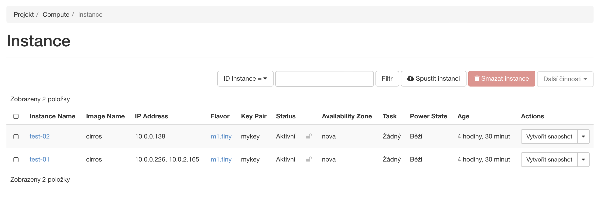
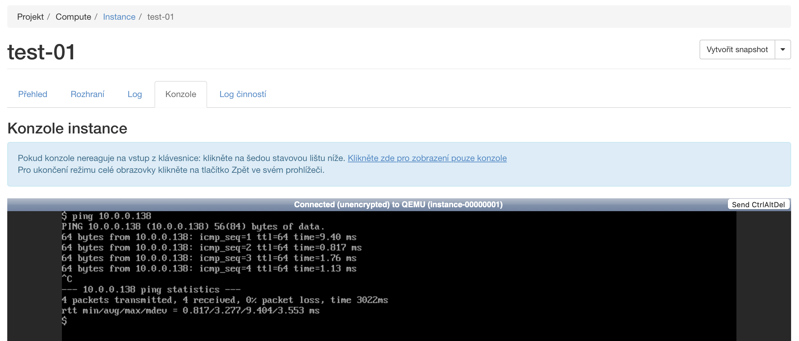

= Cvičení 3

== Nasazený OpenStack na 2 uzlech (řídící a výpočetní)

OpenStack je nasazený na řídícím uzlu `wrzecond-01` a výpočetním uzlu `wrzecond-02`. Kvůli následujícímu úkolu je i uzel `wrzecond-01` nastaven jako výpočetní.

=== Postup nasazení

Nejprve jsem na řídícím uzlu `wrzecond-01` vygeneroval SSH klíč, který jsem přidal jakožto autorizovaný na oba dva servery (`wrzecond-01` i `wrzecond-02`). Při následném připojení jsem pak klíče potvrdil.

[source,shell]
----
# wrzecond-01
ssh-keygen
cat .ssh/id_rsa.pub >> .ssh/authorized_keys
# wrzecond-02
vi .ssh/authorized_keys
# (copy key from wrzecond-01)

# wrzecond-01
ssh wrzecond-01.vcc
# logout
ssh wrzecond-02.vcc
# logout
----

Následně jsem na obou počítačích aktualizoval packages a nainstaloval Python a pip:

[source,shell]
----
sudo apt update
sudo apt upgrade

sudo apt install git python3-dev libffi-dev gcc libssl-dev
sudo apt install python3-pip
sudo pip3 install -U pip
----

Na počítačích jsem přidal virtuální rozhraní `veth0` a `veth1`, která jsou propojená _(kvůli kolle, která vyžaduje dvě rozhraní)_.

[source,text]
----
[NetDev]
Name=veth0
Kind=veth
[Peer]
Name=veth1
----
Soubor `/etc/systemd/network/25-veth-b1b2.netdev`.

[source,yaml]
----
# This is the network config written by 'subiquity'
network:
  ethernets:
    ens192:
      dhcp4: true
    veth0: {}
    veth1: {}
  version: 2
----
Soubor `/etc/netplan/00-installer-config.yaml`.

Následně jsem přegeneroval netplan a restartoval networkd.

[source,shell]
----
netplan generate
service systemd-networkd stop
service systemd-networkd start
----

Další konfiguraci jsem prováděl už pouze na uzlu `wrzecond-01`:

Nejprve jsem nainstaloval kollu a nakopíroval základní soubory:

[source,shell]
----
sudo pip install -U 'ansible>=4,<6'
sudo pip3 install git+https://opendev.org/openstack/kolla-ansible@stable/zed

sudo mkdir -p /etc/kolla
sudo chown $USER:$USER /etc/kolla
cp -r /usr/local/share/kolla-ansible/etc_examples/kolla/* /etc/kolla/
cp /usr/local/share/kolla-ansible/ansible/inventory/* .

kolla-ansible install-deps
mkdir -p /etc/ansible
----

Následně jsem upravil konfigurační soubory:

[source,text]
----
[defaults]
host_key_checking=False
pipelining=True
forks=100
----
Obsah souboru `/etc/ansible/ansible.cfg`

[source,text]
----
include::files/01/multinode[lines=1..28]
----

Prvních 28 řádek souboru `multinode`. Zbytek zůstal nezměněn.

Lze si povšimnout, že jsem v konfiguraci nastavil `wrzecond-01` jako control, compute, network a monitoring node a `wrzecond-02` jako compute a storage node.

Konfiguraci jsem otestoval pomocí `ansible -i multinode all -m ping`.

Následně jsem vygeneroval hesla pro jednotlivé služby: `kolla-genpwd`.

Dále jsem upravil soubor `/etc/kolla/globals.yml`. Ten naleznete link:files/01/multinode[zde]. Změnil jsem následující řádky:

[source,yaml]
----
kolla_base_distro: "ubuntu"
kolla_internal_vip_address: "10.38.4.172"
network_interface: "ens192"
neutron_external_interface: "veth0"
enable_haproxy: "no"
----

Jako distribuci jsem zvolil Ubuntu, protože se mi s ní lépe pracuje. Interní adresa byla zvolena jako adresa prvního uzlu (`wrzecond-01`), síťové rozhraní jakožto externí rozhraní prvního uzlu (zjištěné pomocí `ip addr`), rozhraní pro neutron jakožto `veth0`. Jeden konec, `veth1` tedy "visí ve vzduchu", v bonusové úloze ho pomocí NAT napojím "do internetu". Vypnutím haproxy umožním vnořenou virtualizaci.

Na závěr již můžu vše spustit:

[source,shell]
----
kolla-ansible -i ./multinode bootstrap-servers
kolla-ansible -i ./multinode prechecks
kolla-ansible -i ./multinode deploy
----

A výsledkem je nasazený OpenStack běžící na dvou uzlech (`wrzecond-01`, `wrzecond-02`).

== OpenStack se 2 uzly, které na sebe dokáží pingovat

OpenStack s běžícími dvěma instancemi. Instance test-01 běží na uzlu `wrzecond-01`, test-02 běží na uzlu `wrzecond-02`.

Instance na sebe dokáží pingovat.

=== Postup spuštění

Stále pracuji pouze na řídícím uzlu (`wrzecond-01`). Nejprve jsem nainstaloval OpenStack klienta, spustil `post-deploy` a `init-runonce` skript, který vytvořil potřebnou infrastrukturu _(síť, obrazy)_.

[source,shell]
----
pip install python-openstackclient -c https://releases.openstack.org/constraints/upper/zed
kolla-ansible post-deploy
/usr/local/share/kolla-ansible/init-runonce
----

Abych se dostal do administračního rozhraní OpenStacku, potřebuji přihlašovací údaje, které najdu pomocí `cat /etc/kolla/passwords.yml | grep keystone_admin`. Přihlásím se pak na adrese http://wrzecond-01.vcc.in.fit.cvut.cz

Nové instance vytvořím pomocí tlačítka Spustit instanci v Projekt / Compute / Instance. Zvolím příslušná jména, jako obraz zvolím `cirros`, typ `tiny` a síť `demo-net`.

Po spuštění a přihlášení již ping mezi instancemi funguje.

== Přístup do internetu

Instance mají přístup do internetu _(dokážou pingnout Google DNS server 8.8.8.8)_.

=== Nastavení

Jak jsem již zmínil dříve, instance se do internetu původně nedostaly, protože nám "viselo ve vzduchu" rozhraní `veth1`. Pomocí NAT maškarády, přiřazení vhodné IP tomuto rozhraní a povolení NAT forwardingu jsme schopni toto zprovoznit:

[source,shell]
----
iptables -t nat -A POSTROUTING -o ens192 -j MASQUERADE
ip addr add 10.0.2.1/24 dev veth1
echo 1 > /proc/sys/net/ipv4/ip_forward
----

Výsledkem je funkční `ping` na obou dvou strojích.
