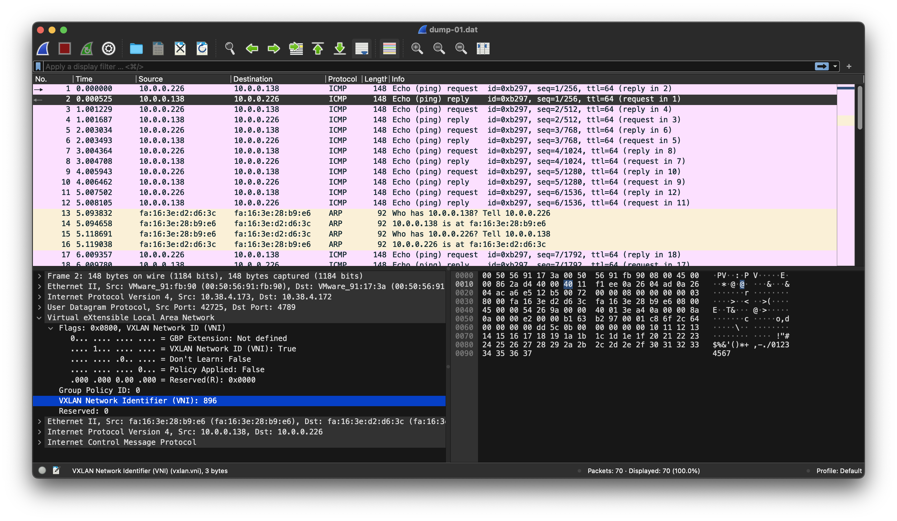
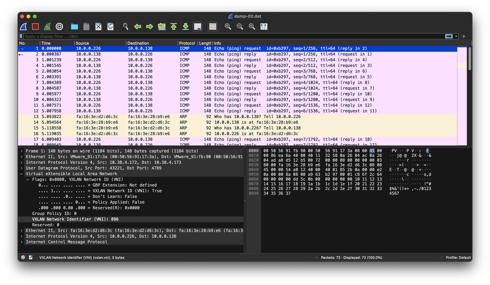
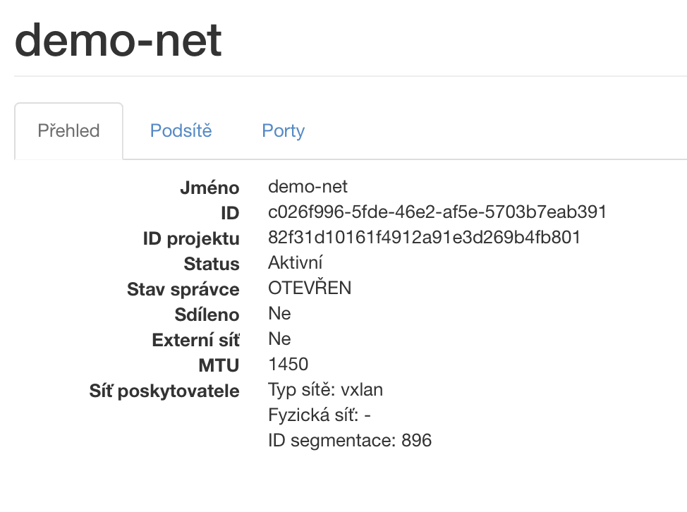
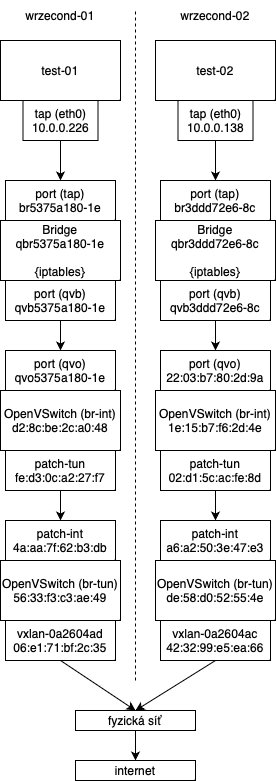

= Cvičení 4

Pracuji na OpenStacku z xref:hw01.adoc[Cvičení 3], mám tedy k dispozici dvě VM, jedna na uzlu `wrzecond-01`, druhá na uzlu `wrzecond-02`.

== Nalezení XML deskriptoru virtuálního stroje

XML deskriptory virtuálního stroje nalezneme v docker kontejneru `nova_libvirt`.

Nejprve si zobrazíme dostupné instance:

[source,text]
----
root@wrzecond-01:~# docker exec -it nova_libvirt bash -i
(nova-libvirt)[root@wrzecond-01 /]# virsh list
 Id   Name                State
-----------------------------------
 1    instance-00000001   running

(nova-libvirt)[root@wrzecond-01 /]# virsh dumpxml instance-00000001
----

Získáme XML deskriptor virtuálního stroje `test-01`, který naleznete ve link:files/02/test-01.xml[]. V něm je schováno i jméno rozhraní `tap5375a180-1e`.

Totéž uděláme na uzlu `wrzecond-02`:

[source,text]
----
root@wrzecond-02:~# docker exec -it nova_libvirt bash -i
(nova-libvirt)[root@wrzecond-02 /]# virsh list
 Id   Name                State
-----------------------------------
 1    instance-00000002   running

(nova-libvirt)[root@wrzecond-02 /]# virsh dumpxml instance-00000002
----

XML deskriptor virtuálního stroje `test-02` nalznete ve link:files/02/test-02.xml[]. Jméno rozhraní je zde `tap3ddd72e6-8c`.

Nyní spustíme ping na jednotlivých VM (pro zajímavost `test-01` bude pingovat `test-02` a `test-02` bude pingovat `8.8.8.8`) a zkusíme trasovat provoz na těchto rozhraních:

[source,text]
----
root@wrzecond-01:~# tcpdump -i tap5375a180-1e
tcpdump: verbose output suppressed, use -v[v]... for full protocol decode
listening on tap5375a180-1e, link-type EN10MB (Ethernet), snapshot length 262144 bytes
18:27:10.854984 IP 10.0.0.226 > 10.0.0.138: ICMP echo request, id 6251, seq 134, length 64
18:27:10.855304 IP 10.0.0.138 > 10.0.0.226: ICMP echo reply, id 6251, seq 134, length 64
18:27:11.808181 ARP, Request who-has 10.0.0.226 tell 10.0.0.138, length 28
18:27:11.808361 ARP, Reply 10.0.0.226 is-at fa:16:3e:d2:d6:3c (oui Unknown), length 28
18:27:11.878756 IP 10.0.0.226 > 10.0.0.138: ICMP echo request, id 6251, seq 135, length 64
18:27:11.879148 IP 10.0.0.138 > 10.0.0.226: ICMP echo reply, id 6251, seq 135, length 64
----

Trasování na uzlu `wrzecond-01`

[source,text]
----
root@wrzecond-02:~# tcpdump -i tap3ddd72e6-8c
tcpdump: verbose output suppressed, use -v[v]... for full protocol decode
listening on tap3ddd72e6-8c, link-type EN10MB (Ethernet), snapshot length 262144 bytes
18:28:16.746073 IP 10.0.0.138 > dns.google: ICMP echo request, id 27147, seq 131, length 64
18:28:16.746999 IP dns.google > 10.0.0.138: ICMP echo reply, id 27147, seq 131, length 64
18:28:17.329057 ARP, Request who-has 10.0.0.226 tell 10.0.0.138, length 28
18:28:17.329995 ARP, Reply 10.0.0.226 is-at fa:16:3e:d2:d6:3c (oui Unknown), length 28
18:28:17.368076 IP 10.0.0.226 > 10.0.0.138: ICMP echo request, id 6251, seq 200, length 64
18:28:17.368167 IP 10.0.0.138 > 10.0.0.226: ICMP echo reply, id 6251, seq 200, length 64
18:28:17.747372 IP 10.0.0.138 > dns.google: ICMP echo request, id 27147, seq 132, length 64
18:28:17.748390 IP dns.google > 10.0.0.138: ICMP echo reply, id 27147, seq 132, length 64
18:28:18.392007 IP 10.0.0.226 > 10.0.0.138: ICMP echo request, id 6251, seq 201, length 64
18:28:18.392179 IP 10.0.0.138 > 10.0.0.226: ICMP echo reply, id 6251, seq 201, length 64
----

Trasování na uzlu `wrzecond-02`. Jak šlo očekávat, vidíme zde jak provoz z `test-01`, tak ping do internetu.

== Trasování provozu ve VXLAN v programu Wireshark

Vypnul jsem ping z `test-02` na `8.8.8.8`, nechal jsem pouze ping z `test-01` na `test-02` a spustil jsem trasování pomocí `tcpdump -i ens192 udp -w dump.dat`. Získaný soubor s raw-data jsem následně importoval do wiresharku (mimo to je k dispozici v souborech link:files/02/dump-01.dat[] a link:files/02/dump-02.dat[]).

Ukázka VXLAN dumpů ve Wiresharku. Můžeme si všimnout, že opravdu jsou data obalena VXLAN hlavičkou _(tak, jak bylo na přednášce)_, ve které je VNI, neboli identifikátor virtuální sítě *896*, který sedí s identifikátorem, který můžeme vidět v administraci OpenStacku.

== Diagram síťových prvků

Jednotlivé VMs jsou připojeny pomocí `eth0 - tap` rozhraní, jehož IP adresu můžeme vidět například v konzoli OpenStacku přes bridge `qbr` do OpenVSwitche. Konfiguraci OpenVSwitche si můžeme zobrazit v docker kontejneru `openvswitch_vswitchd` pomocí příkazů `ovs-vsctl`.

Kompletní souhrn příkazů, pomocí kterých jsem zjistil adresy rozhraní do diagramů naleznete v souborech link:files/02/ovs-01.txt[] a link:files/02/ovs-02.txt[].

V OpenVSwitchi je zařízení připojeno přes integration bridge `br-int`, tunnel bridge `br-tun` virtuální sítí (vxlan) až do fyzické sítě, a z té pak na internet.

== Trasování provozu služby

Hledám, kudy se dostanou k jednotlivým instancím metadata. Když si v instanci spustím příkaz `ip route`, zjistím, že adresa `169.254.169.254` je routována na `10.0.0.2`, kde leží DHCP server (což se dá zjistit v OpenStack > Sítě > demo-net > porty > hledám network:dhcp).

[source,text]
----
root@wrzecond-01:~# ssh cirros@10.0.2.165
$ ip route
default via 10.0.0.1 dev eth0  src 10.0.0.226  metric 1002
10.0.0.0/24 dev eth0 scope link  src 10.0.0.226  metric 1002
169.254.169.254 via 10.0.0.2 dev eth0  src 10.0.0.226  metric 1002
----

Pomocí příkazu `ip netns` zjistím, kterému rozhraní tento server odpovídá:

[source,text]
----
root@wrzecond-01:~# ip netns
qrouter-215e2ff8-c4b4-4365-8120-06c52a07aba4 (id: 1)
qdhcp-c026f996-5fde-46e2-af5e-5703b7eab391 (id: 0)
root@wrzecond-01:~# ip netns exec qdhcp-c026f996-5fde-46e2-af5e-5703b7eab391 ip addr
1: lo: <LOOPBACK,UP,LOWER_UP> mtu 65536 qdisc noqueue state UNKNOWN group default qlen 1000
    link/loopback 00:00:00:00:00:00 brd 00:00:00:00:00:00
    inet 127.0.0.1/8 scope host lo
       valid_lft forever preferred_lft forever
    inet6 ::1/128 scope host
       valid_lft forever preferred_lft forever
9: tap97068b0f-08: <BROADCAST,MULTICAST,UP,LOWER_UP> mtu 1450 qdisc noqueue state UNKNOWN group default qlen 1000
    link/ether fa:16:3e:e0:64:a8 brd ff:ff:ff:ff:ff:ff
    inet 169.254.169.254/32 brd 169.254.169.254 scope global tap97068b0f-08
       valid_lft forever preferred_lft forever
    inet 10.0.0.2/24 brd 10.0.0.255 scope global tap97068b0f-08
       valid_lft forever preferred_lft forever
    inet6 fe80::a9fe:a9fe/64 scope link
       valid_lft forever preferred_lft forever
    inet6 fe80::f816:3eff:fee0:64a8/64 scope link
       valid_lft forever preferred_lft forever
----

Vidím, že mě bude zajímat rozhraní `tap97068b0f-08`. Budu tedy odposlouchávat toto rozhraní pod DHCP namespace s parametry `-ll` (aby se nám data vypsala hned do terminálu) a `-vv` (abychom dostali "ukecaný" výstup):

[source,text]
----
root@wrzecond-01:~# ip netns exec qdhcp-c026f996-5fde-46e2-af5e-5703b7eab391 tcpdump -ll -vv -i tap97068b0f-08
tcpdump: listening on tap97068b0f-08, link-type EN10MB (Ethernet), snapshot length 262144 bytes
----

Provedeme _(v druhém okně terminálu)_ požadavky na server:

[source,text]
----
root@wrzecond-01:~# ssh cirros@10.0.2.165
$ curl 169.254.169.254
1.0
2007-01-19
2007-03-01
2007-08-29
2007-10-10
2007-12-15
2008-02-01
2008-09-01
2009-04-04
latest
$ curl 169.254.169.254/latest/meta-data/hostname
test-01.novalocal
----

A zjistíme následující informace o jménu instance:

[source,text]
----
19:42:39.650750 IP (tos 0x0, ttl 64, id 4921, offset 0, flags [DF], proto TCP (6), length 60)
    10.0.0.226.48422 > 169.254.169.254.http: Flags [S], cksum 0xb637 (correct), seq 164491151, win 64860, options [mss 1410,sackOK,TS val 3159409307 ecr 0,nop,wscale 6], length 0
19:42:39.650792 IP (tos 0x0, ttl 64, id 0, offset 0, flags [DF], proto TCP (6), length 60)
    169.254.169.254.http > 10.0.0.226.48422: Flags [S.], cksum 0x5f0d (incorrect -> 0x78d5), seq 1901786284, ack 164491152, win 64308, options [mss 1410,sackOK,TS val 186568274 ecr 3159409307,nop,wscale 7], length 0
19:42:39.651016 IP (tos 0x0, ttl 64, id 4922, offset 0, flags [DF], proto TCP (6), length 52)
    10.0.0.226.48422 > 169.254.169.254.http: Flags [.], cksum 0x5f05 (incorrect -> 0x9eae), seq 1, ack 1, win 1014, options [nop,nop,TS val 3159409307 ecr 186568274], length 0
19:42:39.651226 IP (tos 0x0, ttl 64, id 4923, offset 0, flags [DF], proto TCP (6), length 131)
    10.0.0.226.48422 > 169.254.169.254.http: Flags [P.], cksum 0x5f54 (incorrect -> 0xc60c), seq 1:80, ack 1, win 1014, options [nop,nop,TS val 3159409308 ecr 186568274], length 79: HTTP, length: 79
	GET / HTTP/1.1
	Host: 169.254.169.254
	User-Agent: curl/7.84.0
	Accept: */*

19:42:39.691489 IP (tos 0x0, ttl 64, id 3791, offset 0, flags [DF], proto TCP (6), length 267)
    169.254.169.254.http > 10.0.0.226.48422: Flags [P.], cksum 0x5fdc (incorrect -> 0x623e), seq 1:216, ack 80, win 502, options [nop,nop,TS val 186568315 ecr 3159409308], length 215: HTTP, length: 215
	HTTP/1.1 200 OK
	content-type: text/plain; charset=UTF-8
	content-length: 98
	date: Tue, 04 Apr 2023 19:42:39 GMT

	1.0
	2007-01-19
	2007-03-01
	2007-08-29
	2007-10-10
	2007-12-15
	2008-02-01
	2008-09-01
	2009-04-04
	latest [|http]
19:42:39.692655 IP (tos 0x0, ttl 64, id 4924, offset 0, flags [DF], proto TCP (6), length 52)
    10.0.0.226.48422 > 169.254.169.254.http: Flags [.], cksum 0x5f05 (incorrect -> 0x9d39), seq 80, ack 216, win 1011, options [nop,nop,TS val 3159409348 ecr 186568315], length 0
19:42:39.692658 IP (tos 0x0, ttl 64, id 4925, offset 0, flags [DF], proto TCP (6), length 52)
    10.0.0.226.48422 > 169.254.169.254.http: Flags [F.], cksum 0x5f05 (incorrect -> 0x9d37), seq 80, ack 216, win 1011, options [nop,nop,TS val 3159409349 ecr 186568315], length 0
19:42:39.693266 IP (tos 0x0, ttl 64, id 3792, offset 0, flags [DF], proto TCP (6), length 52)
    169.254.169.254.http > 10.0.0.226.48422: Flags [F.], cksum 0x5f05 (incorrect -> 0x9f32), seq 216, ack 81, win 502, options [nop,nop,TS val 186568316 ecr 3159409349], length 0
19:42:39.693383 IP (tos 0x0, ttl 64, id 4926, offset 0, flags [DF], proto TCP (6), length 52)
    10.0.0.226.48422 > 169.254.169.254.http: Flags [.], cksum 0x5f05 (incorrect -> 0x9d34), seq 81, ack 217, win 1011, options [nop,nop,TS val 3159409350 ecr 186568316], length 0

19:45:53.056601 IP (tos 0x0, ttl 64, id 23929, offset 0, flags [DF], proto TCP (6), length 60)
    10.0.0.226.51208 > 169.254.169.254.http: Flags [S], cksum 0xa81b (correct), seq 2939443638, win 64860, options [mss 1410,sackOK,TS val 3159602756 ecr 0,nop,wscale 6], length 0
19:45:53.056653 IP (tos 0x0, ttl 64, id 0, offset 0, flags [DF], proto TCP (6), length 60)
    169.254.169.254.http > 10.0.0.226.51208: Flags [S.], cksum 0x5f0d (incorrect -> 0x7a08), seq 4246693399, ack 2939443639, win 64308, options [mss 1410,sackOK,TS val 186761680 ecr 3159602756,nop,wscale 7], length 0
19:45:53.056865 IP (tos 0x0, ttl 64, id 23930, offset 0, flags [DF], proto TCP (6), length 52)
    10.0.0.226.51208 > 169.254.169.254.http: Flags [.], cksum 0x5f05 (incorrect -> 0x9fe0), seq 1, ack 1, win 1014, options [nop,nop,TS val 3159602757 ecr 186761680], length 0
19:45:53.057028 IP (tos 0x0, ttl 64, id 23931, offset 0, flags [DF], proto TCP (6), length 156)
    10.0.0.226.51208 > 169.254.169.254.http: Flags [P.], cksum 0x5f6d (incorrect -> 0x2c00), seq 1:105, ack 1, win 1014, options [nop,nop,TS val 3159602757 ecr 186761680], length 104: HTTP, length: 104
	GET /latest/meta-data/hostname HTTP/1.1
	Host: 169.254.169.254
	User-Agent: curl/7.84.0
	Accept: */*

19:45:53.104837 IP (tos 0x0, ttl 64, id 2385, offset 0, flags [DF], proto TCP (6), length 52)
    169.254.169.254.http > 10.0.0.226.51208: Flags [.], cksum 0x5f05 (incorrect -> 0xa148), seq 1, ack 105, win 502, options [nop,nop,TS val 186761728 ecr 3159602757], length 0
19:45:53.238054 IP (tos 0x0, ttl 64, id 2386, offset 0, flags [DF], proto TCP (6), length 186)
    169.254.169.254.http > 10.0.0.226.51208: Flags [P.], cksum 0x5f8b (incorrect -> 0xea45), seq 1:135, ack 105, win 502, options [nop,nop,TS val 186761861 ecr 3159602757], length 134: HTTP, length: 134
	HTTP/1.1 200 OK
	content-type: text/plain; charset=UTF-8
	content-length: 17
	date: Tue, 04 Apr 2023 19:45:53 GMT

	test-01.novalocal [|http]
19:45:53.239390 IP (tos 0x0, ttl 64, id 23932, offset 0, flags [DF], proto TCP (6), length 52)
    10.0.0.226.51208 > 169.254.169.254.http: Flags [.], cksum 0x5f05 (incorrect -> 0x9d8a), seq 105, ack 135, win 1012, options [nop,nop,TS val 3159602938 ecr 186761861], length 0
19:45:53.239393 IP (tos 0x0, ttl 64, id 23933, offset 0, flags [DF], proto TCP (6), length 52)
    10.0.0.226.51208 > 169.254.169.254.http: Flags [F.], cksum 0x5f05 (incorrect -> 0x9d88), seq 105, ack 135, win 1012, options [nop,nop,TS val 3159602939 ecr 186761861], length 0
19:45:53.239471 IP (tos 0x0, ttl 64, id 2387, offset 0, flags [DF], proto TCP (6), length 52)
    169.254.169.254.http > 10.0.0.226.51208: Flags [F.], cksum 0x5f05 (incorrect -> 0x9f83), seq 135, ack 106, win 502, options [nop,nop,TS val 186761863 ecr 3159602939], length 0
19:45:53.239749 IP (tos 0x0, ttl 64, id 23934, offset 0, flags [DF], proto TCP (6), length 52)
    10.0.0.226.51208 > 169.254.169.254.http: Flags [.], cksum 0x5f05 (incorrect -> 0x9d84), seq 106, ack 136, win 1012, options [nop,nop,TS val 3159602940 ecr 186761863], length 0
----

Na požadavky odpovídá *Nova API*, která je v kontejneru `nova_api`. Poté, co se dostanou z virtuálky, tak se dostanou k *Neutron metadata* agentovi (kontejner neutron_metadata_agent), který je *přepošle* na tu Nova API službu, která poslouchá na portu `8775`. Viz `/etc/neutron/metadata_agent.ini`:

[source,text]
----
root@wrzecond-01:~# docker exec -it neutron_metadata_agent /bin/bash
(neutron-metadata-agent)[neutron@wrzecond-01 /]$ cat /etc/neutron/metadata_agent.ini
[DEFAULT]
auth_ca_cert =
nova_metadata_host = 10.38.4.172
nova_metadata_port = 8775
metadata_proxy_shared_secret = PgQEUYfmSDMAA8G5IxCxIIWcJfCgfsKf9Dmkui6r
nova_metadata_protocol = http
metadata_workers = 2
----

K tomu ten agent přidá ještě pár *HTTP hlaviček* (IP instance a ID routeru), pomocí kterých právě ta služba *pozná*, o co jde.
