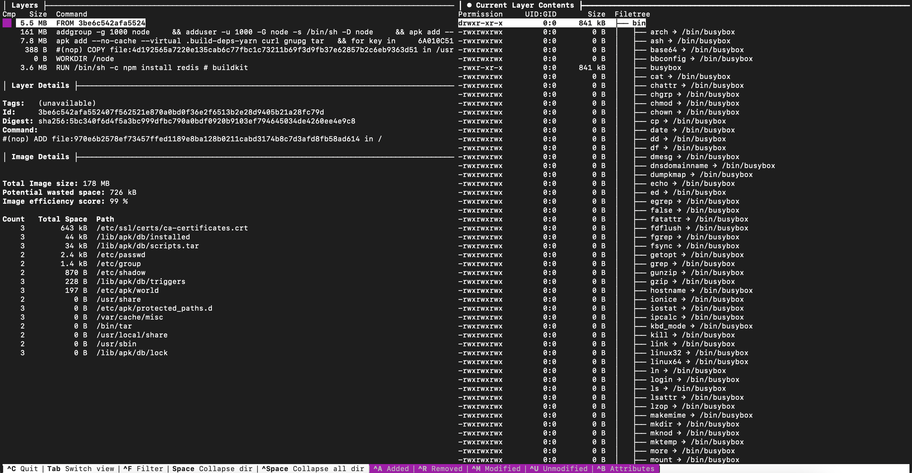
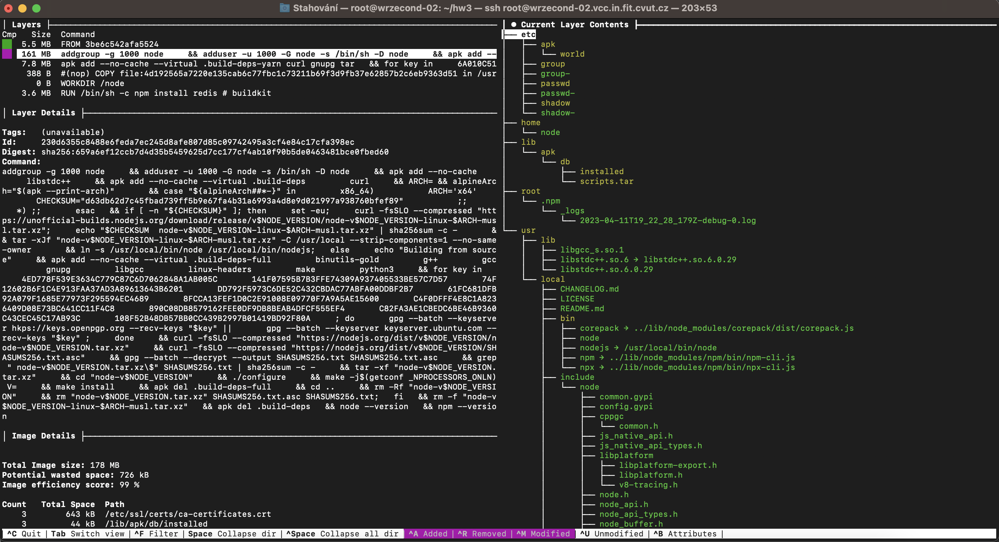
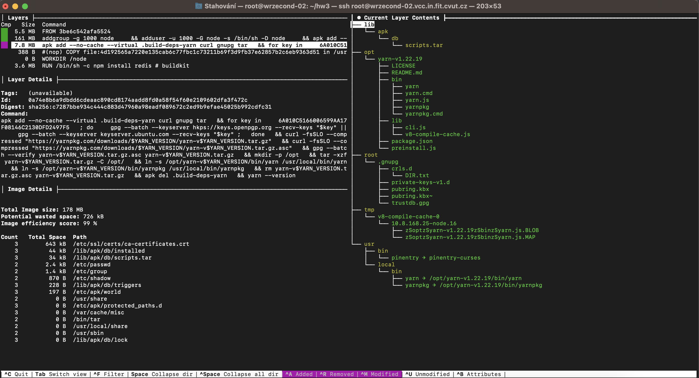
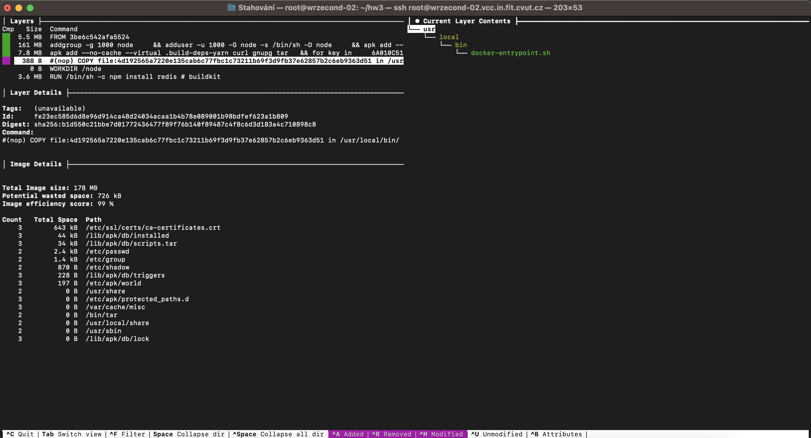
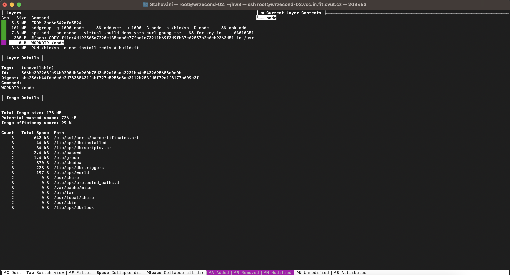
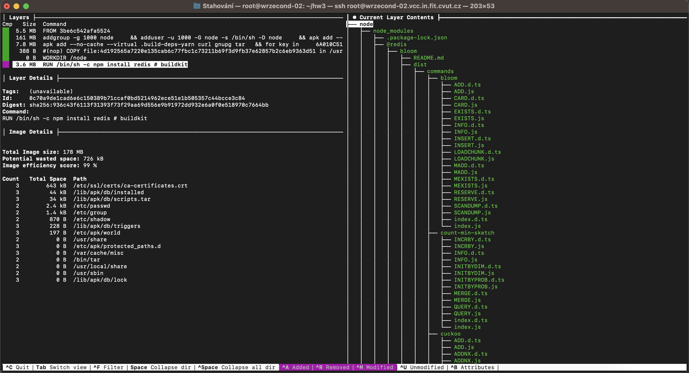
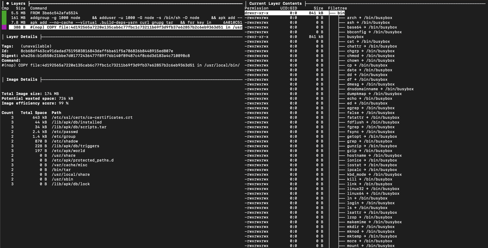

= Cvičení 5

Docker kontejnery budu spouštět na druhé instanci `wrzecond-02` na infrastruktuře Cloud FIT.

== Sestavení obrazu s webovou aplikací metodou Dockerfile

Rozhodl jsem se sestavit jednoduchou webovou aplikaci z předmětu NI-AM2. Jedná se o *Node.js* server, který se připojuje k in-memory databázi *redis* běžící ve druhém kontejneru.

Spuštění Docker kontejneru s `redis` databází s názvem `redisdb`:

[source,text]
----
root@wrzecond-02:~/hw3# docker run --name redisdb -d redis
Unable to find image 'redis:latest' locally
latest: Pulling from library/redis
26c5c85e47da: Already exists
39f79586dcf2: Pull complete
79c71d0520e5: Pull complete
60e988668ca1: Pull complete
873c3fc9fdc6: Pull complete
50ce7f9bf183: Pull complete
Digest: sha256:f50031a49f41e493087fb95f96fdb3523bb25dcf6a3f0b07c588ad3cdbe1d0aa
Status: Downloaded newer image for redis:latest
0ab0729bca64732113291dc21a22a1f0ec6aee8c79af75eda5117d69d8821eb6
----

Nastavení ukázkových dat v Redis kontejneru:

[source,text]
----
root@wrzecond-02:~/hw3# docker exec -it redisdb sh
# redis-cli
127.0.0.1:6379> set John "Thakurova 9, 160 00, Prague"
OK
127.0.0.1:6379> set Karel "Na Piskach 136, 561 69 Kraliky"
OK
127.0.0.1:6379> set Alice "Soukenicka 556, 602 00 Brno"
OK
127.0.0.1:6379> get Karel
"Na Piskach 136, 561 69 Kraliky"
----

Vytvoření Dockerfile:

[source,dockerfile]
----
include::files/03/Dockerfile[]
----

Sestavení image `nodejs` pomocí `docker build`:

[source,text]
----
root@wrzecond-02:~/hw3# docker build -t nodejs .
[+] Building 12.0s (7/7) FINISHED
 => [internal] load build definition from Dockerfile                       0.0s
 => => transferring dockerfile: 123B                                       0.0s
 => [internal] load .dockerignore                                          0.0s
 => => transferring context: 2B                                            0.0s
 => [internal] load metadata for docker.io/library/node:19-alpine3.16      1.2s
 => [1/3] FROM docker.io/library/node:19-alpine3.16@sha256:d0b456784d4035  4.4s
 => => resolve docker.io/library/node:19-alpine3.16@sha256:d0b456784d4035  0.0s
 => => sha256:91d30c5bc19582de1415b18f1ec5bcbf52a558b62cf 2.81MB / 2.81MB  0.2s
 => => sha256:cb27466e524cc644f68e9376337af9ae72ac5d093 47.95MB / 47.95MB  0.9s
 => => sha256:c5593a218d6858fa5df86829cf333c103beddc6c7fa 2.35MB / 2.35MB  0.5s
 => => sha256:d0b456784d40354f567844fbebfbbd93b6501c7e76c 1.43kB / 1.43kB  0.0s
 => => sha256:2199742f1f124a7ee412482f6823cde2e057ff6eaa1 1.16kB / 1.16kB  0.0s
 => => sha256:d76736119b7d066ce54359e599f8aae1eebde387ba2 6.48kB / 6.48kB  0.0s
 => => extracting sha256:91d30c5bc19582de1415b18f1ec5bcbf52a558b62cf6cc20  0.4s
 => => sha256:1b5c72d1cb109373cd0de994e204660168bfbb47cf9cea9 451B / 451B  0.5s
 => => extracting sha256:cb27466e524cc644f68e9376337af9ae72ac5d0932c9184e  3.0s
 => => extracting sha256:c5593a218d6858fa5df86829cf333c103beddc6c7fa343fe  0.1s
 => => extracting sha256:1b5c72d1cb109373cd0de994e204660168bfbb47cf9cea94  0.0s
 => [2/3] WORKDIR /server                                                  0.2s
 => [3/3] RUN npm install redis                                            5.9s
 => exporting to image                                                     0.2s
 => => exporting layers                                                    0.2s
 => => writing image sha256:2c0e6089a9afac357bbe0a0d9f8568f2724c6f274dd1390992a0d657b52e9abb  0.0s
 => => naming to docker.io/library/nodejs
----

Spuštění kontejneru `nodejs` ze sestaveného obrazu `nodejs`:

[source,text]
----
root@wrzecond-02:~/hw3# docker run --name node -p 8080:8888 -v `pwd`/nodejs/:/node/server --link redisdb -d nodejs
401c1b66175ebe4d0365c9a7586bacdb88da900ce067a7f380d11556a2eda337
----

Všimněte si, že je zde namapována složka `nodejs` obsahující `server.js`, nalinkován kontejner `redisdb`.

Otestování nově vytvořeného obrazu *zvenku*:

[source,text]
----
kvetinac97@e-79-197 ~ % curl wrzecond-02.vcc.in.fit.cvut.cz:8080/person/John/address
Address: Thakurova 9, 160 00, Prague
kvetinac97@e-79-197 ~ % curl wrzecond-02.vcc.in.fit.cvut.cz:8080/person/Karel/address
Address: Na Piskach 136, 561 69 Kraliky
kvetinac97@e-79-197 ~ % curl wrzecond-02.vcc.in.fit.cvut.cz:8080/person/Alice/address
Address: Soukenicka 556, 602 00 Brno
----

Provedli jsme tedy *sestavení obrazu* _(a spuštění kontejnerů včetně propojení)_:

[source,text]
----
root@wrzecond-02:~/hw3# docker ps
CONTAINER ID   IMAGE                                                                COMMAND                  CREATED         STATUS                 PORTS                                       NAMES
401c1b66175e   nodejs                                                               "docker-entrypoint.s…"   2 minutes ago   Up 2 minutes           0.0.0.0:8080->8888/tcp, :::8080->8888/tcp   node
0ab0729bca64   redis                                                                "docker-entrypoint.s…"   5 minutes ago   Up 5 minutes           6379/tcp                                    redisdb

root@wrzecond-02:~/hw3# docker image ls
REPOSITORY                                                    TAG                IMAGE ID       CREATED          SIZE
nodejs                                                        latest             2c0e6089a9af   18 minutes ago   178MB
redis                                                         latest             eca1379fe8b5   7 days ago       117MB
----

== Analýza obrazu ve formátu OCI/Docker

Pro analýzu využiji nástroj `dive`, který byl předveden na cvičení. Použil jsem tedy příkaz `dive nodejs` a proklikal jednotlivé vrstvy:

Výchozí obraz (vrstva 1) `alpine:3.16`, ze kterého vychází https://github.com/nodejs/docker-node/blob/3b210a6d277538912aa45266ba4bc83d4899c2ca/19/alpine3.16/Dockerfile[Dockerfile pro náš podkladový obraz node:19-alpine3.6].

Druhá vrstva vznikla zavoláním první sady příkazů v Dockerfilu pro node.

Třetí vrstva vznikla instalací node pomocí `apk add` (druhá sada příkazů v Dockerfilu pro node).

Čtvrtá vrstva vznikla příkazem `COPY docker-entrypoint.sh /usr/local/bin/` v Dockerfilu pro node, který zkopíroval soubor `docker-entrypoint.sh`. Tato vrstva je *POKLADOVOU* pro náš obraz.

Pátá vrstva vznikla přepnutím pracovního adresáře na `/node` (dostáváme se konečně do *našeho Dockerfile*)

Šestá, poslední vrstva přišla instalací npm balíčku `redis`.

Historii docker image si můžeme zobrazit také pomocí příkazu `docker image history`:

[source,text]
----
root@wrzecond-02:~/hw3# docker image history nodejs
IMAGE          CREATED          CREATED BY                                      SIZE      COMMENT
2c0e6089a9af   31 minutes ago   CMD ["/bin/sh" "-c" "node server/server.js"]    0B        buildkit.dockerfile.v0
<missing>      31 minutes ago   RUN /bin/sh -c npm install redis # buildkit     3.56MB    buildkit.dockerfile.v0
<missing>      31 minutes ago   WORKDIR /node                                   0B        buildkit.dockerfile.v0
<missing>      13 days ago      /bin/sh -c #(nop)  CMD ["node"]                 0B
<missing>      13 days ago      /bin/sh -c #(nop)  ENTRYPOINT ["docker-entry…   0B
<missing>      13 days ago      /bin/sh -c #(nop) COPY file:4d192565a7220e13…   388B
<missing>      13 days ago      /bin/sh -c apk add --no-cache --virtual .bui…   7.78MB
<missing>      13 days ago      /bin/sh -c #(nop)  ENV YARN_VERSION=1.22.19     0B
<missing>      13 days ago      /bin/sh -c addgroup -g 1000 node     && addu…   161MB
<missing>      13 days ago      /bin/sh -c #(nop)  ENV NODE_VERSION=19.9.0      0B
<missing>      3 weeks ago      /bin/sh -c #(nop)  CMD ["/bin/sh"]              0B
<missing>      3 weeks ago      /bin/sh -c #(nop) ADD file:970e6b2578ef73457…   5.55MB
----

Kde vidíme image s vrstvou *pro zápis*, který vznikl spuštěním kontejneru, pod ním vidíme zpětně vrstvu 6 – instalaci `redis`, 5 – změnu pracovního adresáře, *podkladovou vrstvu 4* – přidání Docker entrypointu a 3 – `apk add`, 2 – `addgroup` příkazy z Node Dockerfilu a 1 – výchozí vrstvu. Mezi tím jsou také vrstvy, ve kterých se nic nezměnilo _(prázdné vrstvy)_.

Pokud si stáhneme obraz pomocí `docker save` a podíváme se do `manifest.json`, uvidíme přesně těchto 5 vrstev:

[source,json]
----
include::files/03/manifest.json[]
----

Podle screenů z `dive` vidíme, že první vrstvou `3be6` bude  vrstva Alpine linuxu (1), následuje `230d` addgroup (2), `0a74` apk add (3), `fe23` přidání souboru pro Docker entrypoint (4), což je naše *podkladová vrstva*, ze které pak vychází vrstvy `566b` změna pracovního adresáře (5) a `0c70` instalace redis (6).

Pokud si zkusíme rozbalit soubory `layer.tar` jednotlivých vrstev, zjistíme, že se opravdu změnily ty soubory, co jsme mohli vidět i v `dive` a vrstvy odpovídají.

Když provedeme `dive` na náš podkladový obraz vycházející z vrstvy (4), opravdu vidíme, že zde *nejsou* vrstvy (5) a (6):

== Vytvoření systémového kontejneru

Pro vytvoření systémového kontejneru jsem se rozhodl využít image Arch Linux. Nejprve jsem tento obraz vytvořil jako `arch-linux` pomocí `machinectl pull-raw`

[source,text]
----
root@wrzecond-02:~# machinectl pull-raw --verify=no https://hub.nspawn.org/storage/archlinux/archlinux/raw/image.raw.xz arch-linux
Enqueued transfer job 2. Press C-c to continue download in background.
Pulling 'https://hub.nspawn.org/storage/archlinux/archlinux/raw/image.raw.xz', saving as 'arch-linux'.
Downloading 423.5M for https://hub.nspawn.org/storage/archlinux/archlinux/raw/image.raw.xz.
...
Download of https://hub.nspawn.org/storage/archlinux/archlinux/raw/image.raw.xz complete.
Created new local image 'arch-linux'.
Operation completed successfully.
Exiting.
----

Následně jsem kontejner spustil pomocí `systemd-nspawn` s parametry `-b` (boot) a `-M arch-linux`. Rozhodl jsem se jej také napojit na virtuální bridge dockeru.

[source,text]
----
root@wrzecond-02:~# systemd-nspawn -M arch-linux -b --network-bridge=docker0
Spawning container arch-linux on /var/lib/machines/arch-linux.raw.
Press ^] three times within 1s to kill container.
systemd 253.3-3-arch running in system mode (+PAM +AUDIT -SELINUX -APPARMOR -IMA +SMACK +SECCOMP +GCRYPT +GNUTLS +OPENSSL +ACL +BLKID +CURL +ELFUTILS +FIDO2 +IDN2 -IDN +IPTC +KMOD +LIBCRYPTSETUP +LIBFDISK +PCRE2 -PWQUALITY +P11KIT -QRENCODE +TPM2 +BZIP2 +LZ4 +XZ +ZLIB +ZSTD +BPF_FRAMEWORK +XKBCOMMON +UTMP -SYSVINIT default-hierarchy=unified)
Detected virtualization systemd-nspawn.
Detected architecture x86-64.
...
Welcome to Arch Linux!

Hostname set to <archlinux>.
Not running with unified cgroup hierarchy, disabling cgroup BPF features.
Queued start job for default target Graphical Interface.
[  OK  ] Created slice Slice /system/getty.
[  OK  ] Created slice Slice /system/modprobe.
...

Arch Linux 5.15.0-58-generic (pts/0)

archlinux login:
----

Do kontejneru jsem se následně přihlásil pomocí default uživatelských údajů `root` a `root` a ověřil jsem, že je zde opravdu init proces a že se správně napojil na Docker rozhraní:

[source,text]
----
[root@archlinux ~]# ps -aux
USER         PID %CPU %MEM    VSZ   RSS TTY      STAT START   TIME COMMAND
root           1  0.2  0.2  19208 11324 ?        Ss   19:20   0:00 /usr/lib/systemd/systemd
root          18  0.0  0.2  32300  8972 ?        Ss   19:20   0:00 /usr/lib/systemd/systemd-journald
root          25  0.0  0.1  15608  6568 ?        Ss   19:20   0:00 /usr/lib/systemd/systemd-userdbd
...
root          52  0.0  0.1   5156  4204 pts/0    Ss   19:21   0:00 -bash
root          56  0.0  0.1   9000  4080 pts/0    R+   19:21   0:00 ps -aux

[root@archlinux ~]# ip addr
1: lo: <LOOPBACK,UP,LOWER_UP> mtu 65536 qdisc noqueue state UNKNOWN group default qlen 1000
    link/loopback 00:00:00:00:00:00 brd 00:00:00:00:00:00
    inet 127.0.0.1/8 scope host lo
       valid_lft forever preferred_lft forever
    inet6 ::1/128 scope host
       valid_lft forever preferred_lft forever
2: host0@if87: <BROADCAST,MULTICAST,UP,LOWER_UP> mtu 1500 qdisc noqueue state UP group default qlen 1000
    link/ether f6:95:65:0d:eb:b5 brd ff:ff:ff:ff:ff:ff link-netnsid 0
    inet 169.254.128.230/16 metric 2048 brd 169.254.255.255 scope link host0
       valid_lft forever preferred_lft forever
    inet6 fe80::f495:65ff:fe0d:ebb5/64 scope link
       valid_lft forever preferred_lft forever
----

Vidíme, že je opravdu init proces `systemd` a jsme připojeni pomocí bridge. Pokud se v novém terminálu připojíme do konzole `root@wrzecond-02` a podíváme se na rozhraní, uvidíme, že nám zde přibyl druhý konec bridge pro kontejner:

[source,text]
----
root@wrzecond-02:~# ip addr
...
87: vb-arch-linux@if2: <BROADCAST,MULTICAST,UP,LOWER_UP> mtu 1500 qdisc noqueue master docker0 state UP group default qlen 1000
    link/ether aa:28:b9:37:2e:78 brd ff:ff:ff:ff:ff:ff link-netnsid 3
    inet6 fe80::a828:b9ff:fe37:2e78/64 scope link
       valid_lft forever preferred_lft forever
----

Kompletní logy najdete v souboru xref:files/03/arch.log[]

== Napsání jednotkového souboru pro Systemd (unit file)

Jakožto síťovou službu pro tento úkol jsem se rozhodl využít jednoduchý hello, world Node.js server `simple.js`. Podle kódu ze cvičení jsem pro něj nejprve vytvořil definici služby `nodejs.service` pro uložení k `/etc/systemd/system`:

[source,service]
----
include::files/03/nodejs.service[]
----

Následně jsem spustil *prvotní* analýzu bezpečnosti:

[source,service]
----
root@wrzecond-02:~# systemd-analyze security nodejs
  NAME                                                        DESCRIPTION                                                             EXPOSURE
✗ PrivateNetwork=                                             Service has access to the host's network                                     0.5
✗ User=/DynamicUser=                                          Service runs as root user                                                    0.4
✗ CapabilityBoundingSet=~CAP_SET(UID|GID|PCAP)                Service may change UID/GID identities/capabilities                           0.3
...
✗ CapabilityBoundingSet=~CAP_SYS_PACCT                        Service may use acct()                                                       0.1
✗ CapabilityBoundingSet=~CAP_SYS_TTY_CONFIG                   Service may issue vhangup()                                                  0.1
✗ CapabilityBoundingSet=~CAP_WAKE_ALARM                       Service may program timers that wake up the system                           0.1
✗ RestrictAddressFamilies=~AF_UNIX                            Service may allocate local sockets                                           0.1
✗ ProcSubset=                                                 Service has full access to non-process /proc files (/proc subset=)           0.1

→ Overall exposure level for nodejs.service: 9.6 UNSAFE 😨
----

Kompletní výsledek analýzy naleznete v souboru xref:files/03/security.txt[].

Hlavní věci, které jsou nám zde vyčteny, jsou:

 - *PrivateNetwork*: služba má přístup v hostitelské síti. Jelikož se jedná o Node.js server, museli bychom zde provést nějaké tunelování, proto to nebudeme měnit.
 - *User*: služba běží pod **root**em. Přidán nový uživatel `node-server`, skript přesunut do domovského adresáře uživatele, *opraveno*.
 - *CapabilityBoundingSet*: Služba neuvedla jaká práva používá, přitom žádná nepotřebuje. Přidáno `CapabilityBoundingSet=`, *opraveno*.
 - *RestrictAddressFamilies*: Služba neuvedla jaké internetové adresy si může alokovat, počítá se tedy i s tím, že bude alokovat exotické. Doplněno `RestrictAddressFamilies=AF_UNIX AF_INET AF_INET6 AF_NETLINK`, *opraveno*.
 - a další nastavení, která byla přenastavena podle návodu z https://www.opensourcerers.org/2022/04/25/optimizing-a-systemd-service-for-security/

Upravený soubor pro definici service:

[source,service]
----
include::files/03/nodejs2.service[]
----

Po této úpravě již dosáhneme dokonce *zeleného skóre* 3.3:

[source,service]
----
root@wrzecond-02:~# systemd-analyze security nodejs
  NAME                                                        DESCRIPTION                                                        EXPOSURE
✗ PrivateNetwork=                                             Service has access to the host's network                                0.5
✓ User=/DynamicUser=                                          Service runs under a static non-root user identity
✓ CapabilityBoundingSet=~CAP_SET(UID|GID|PCAP)                Service cannot change UID/GID identities/capabilities
...
✓ CapabilityBoundingSet=~CAP_SYS_PACCT                        Service cannot use acct()
✓ CapabilityBoundingSet=~CAP_SYS_TTY_CONFIG                   Service cannot issue vhangup()
✓ CapabilityBoundingSet=~CAP_WAKE_ALARM                       Service cannot program timers that wake up the system
✗ RestrictAddressFamilies=~AF_UNIX                            Service may allocate local sockets                                      0.1
✗ ProcSubset=                                                 Service has full access to non-process /proc files (/proc subset=)      0.1

→ Overall exposure level for nodejs.service: 3.3 OK 🙂
----

Kompletní bezpečnostní analýza je v souboru xref:files/03/security2.txt[].

Službu lze normálně *spustit*:

[source,text]
----
root@wrzecond-02:~# systemctl status nodejs
● nodejs.service - Simple Node.js server
     Loaded: loaded (/etc/systemd/system/nodejs.service; disabled; vendor preset: enabled)
     Active: active (running) since Tue 2023-04-25 20:12:12 UTC; 3min 40s ago
   Main PID: 3283580 (node)
      Tasks: 7 (limit: 4575)
     Memory: 8.7M
        CPU: 245ms
     CGroup: /system.slice/nodejs.service
             └─3283580 /usr/bin/node /home/node-server/simple.js

Apr 25 20:12:12 wrzecond-02 systemd[1]: nodejs.service: Deactivated successfully.
Apr 25 20:12:12 wrzecond-02 systemd[1]: Stopped Simple Node.js server.
Apr 25 20:12:12 wrzecond-02 systemd[1]: Started Simple Node.js server.
Apr 25 20:12:13 wrzecond-02 node[3283580]: Server running at http://0.0.0.0:8081/
----

A k serveru běžící ve službě se lze připojit také z jiného počítače:

[source,text]
----
kvetinac97@e-79-197 ~ % curl http://wrzecond-02.vcc.in.fit.cvut.cz:8081
Hello!
----
