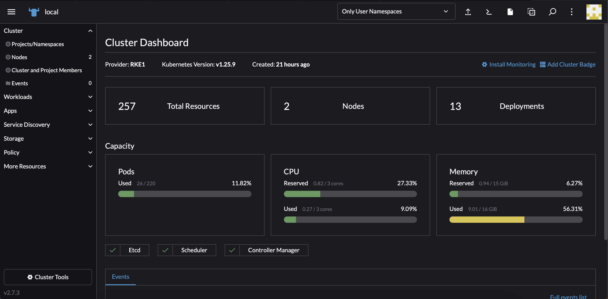
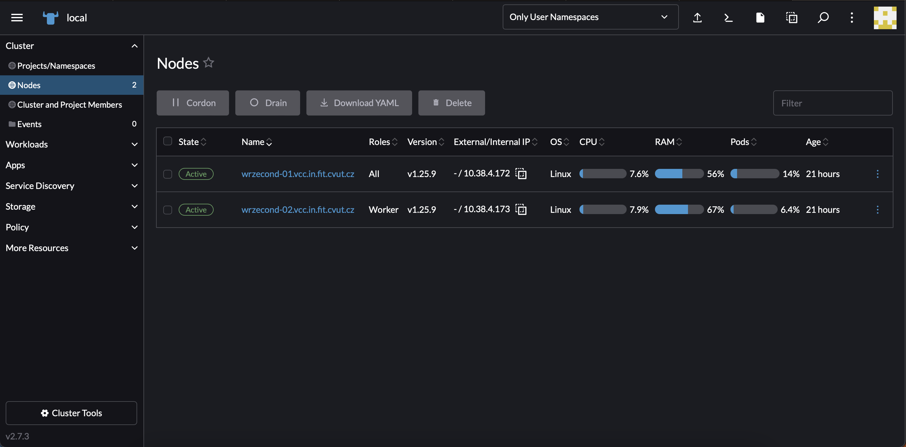
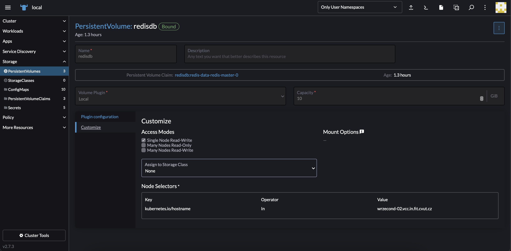
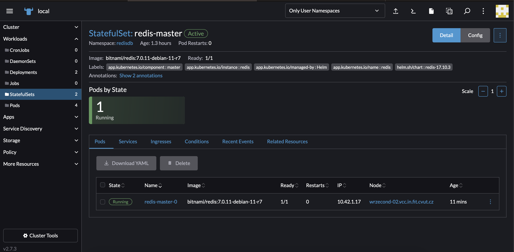
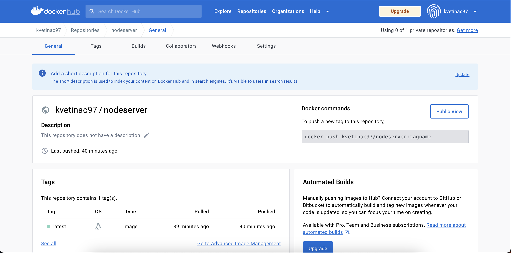
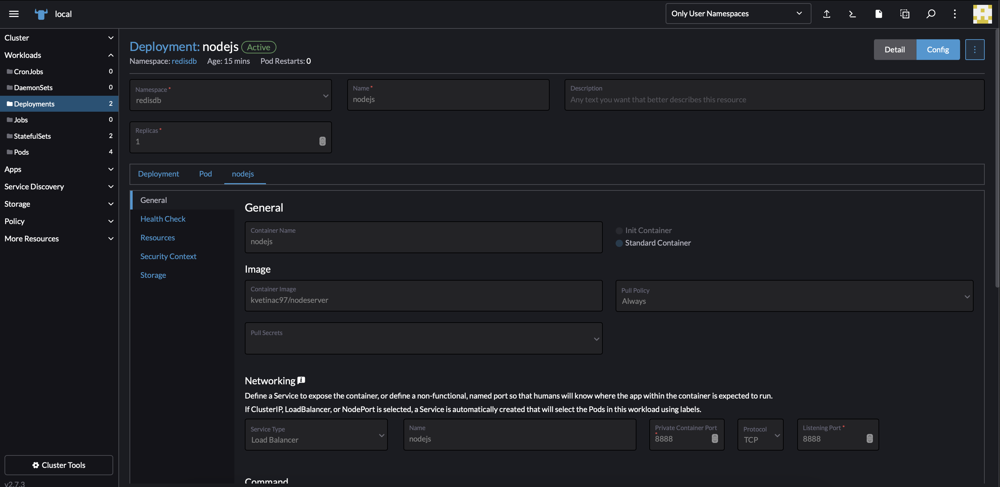
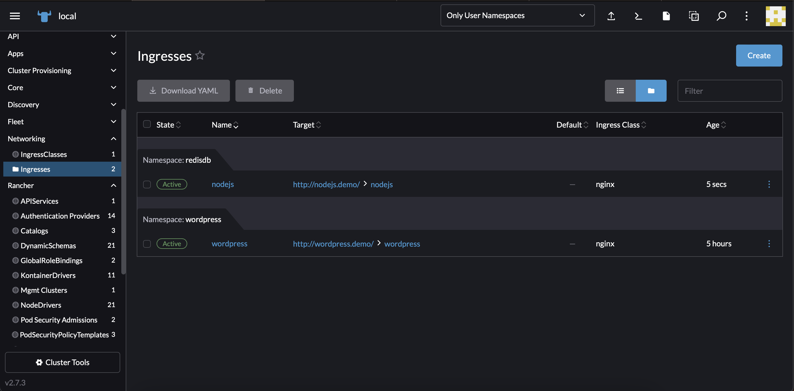
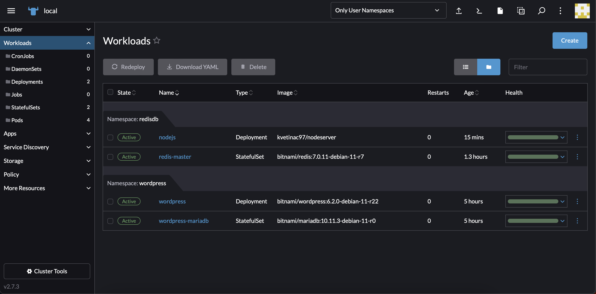
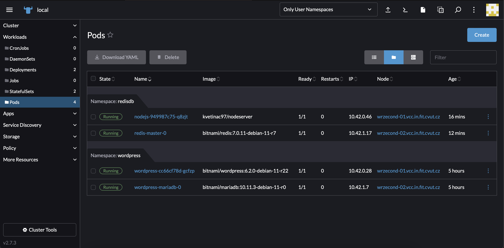

= Cvičení 6

Pro toto cvičení jsem zresetoval svoje virtuální stroje na infrastruktuře Cloud FIT -- `wrzecond-01` a `wrzecond-02`.

== Nasazení klastru Kubernetes o 2 uzlech

Pro nasazení postupuji podle návodu ze cvičení 6. Instalaci provádím ze školního počítače.

Na jednotlivé uzly jsem nejprve nainstaloval Docker _(jediná prerekvizita)_.

[source,shell]
----
apt install -y docker.io
----

Následně jsem si na školním počítači stáhnul RKE (Rancher Kubernetes Engine) binárku pro instalaci:

[source,shell]
----
wget https://github.com/rancher/rke/releases/download/v1.4.5/rke_linux-amd64
----

Pak jsem vytvořil s pomocí `./rke_linux-amd64 config` konfigurační soubor xref:files/04/cluster.yml[cluster.yml] a provedl nasazení:

[source,shell]
----
./rke_linux-amd64 up
----

Při nasazování jsem zadal do souboru špatnou adresu druhého serveru _(zapomněl jsem .vcc.in...)_, musel jsem tedy změnit konfigurační soubor a provést nasazení znova.

Dalším krokem bylo stažení binárek `kubectl` a `helm` pro ovládání clusteru.

[source,shell]
----
curl -LO "https://dl.k8s.io/release/$(curl -L -s https://dl.k8s.io/release/stable.txt)/bin/linux/amd64/kubectl"

wget https://get.helm.sh/helm-v3.11.3-linux-amd64.tar.gz
tar -xvf helm-v3.11.3-linux-amd64.tar.gz
mv linux-amd64/helm .
----

Na cluster jsem následně s pomocí https://gitlab.fit.cvut.cz/fesljan/ni-vcc/raw/master/cviceni6-Makefile[Makefile] ze cvičení nainstaloval Cert manager a grafické prostředí https://www.rancher.com[Rancher].

[source,shell]
----
make k8s-demo-setup-cert-manager
make k8s-demo-install-cert-manager
make k8s-demo-setup-rancher
make k8s-demo-install-rancher
----

V Makefile jsem provedl drobné úpravy tak, aby se binárky nespouštěly z PATH, ale z aktuálního adresáře. Použitý Makefile naleznete xref:files/04/Makefile[zde].

Posledním krokem pak bylo už pouze ověřit instalaci přihlášením se do Rancher konzole. První heslo jsem zjistil pomocí následujícího příkazu:

[source,shell]
----
KUBECONFIG=./kube_config_cluster.yml ./kubectl get secret --namespace cattle-system bootstrap-secret -o go-template='{{.data.bootstrapPassword|base64decode}}{{ "\n" }}'
----

Výsledné heslo: `9w9czbqqzlt8nmgtvdx9r6v7sfbl2gssm2hj6jn7hsjwnl8cj4nmpm`.
Po přihlášení jsem si nastavil nové heslo: `bUpZ28Gfp8tkaMmo`.

Abych se mohl dostat na adresu klastr.demo, kde probíhá administrace, musel jsem na školním počítači spustit chrome s následujícími parametry:

[source,shell]
----
/opt/google/chrome/google-chrome --host-resolver-rules="MAP klastr.demo 10.38.4.172, MAP wordpress.demo 10.38.4.172"
----

Výsledný klastr je nasazen, a běží na dvou uzlech:

== Nasazení aplikace o 2 zdrojích na Kubernetes cluster s použitím YAML

Tuto část jsem již dělal na vlastním notebooku s root oprávněními. Pro připojení mi tedy stačilo přidat do `/etc/hosts` následující řádky:

[source,text]
----
10.38.4.172	klastr.demo
10.38.4.172	nodejs.demo
----

=== Nasazení zdroje redis

Pro databázi jsem se rozhodl _(stejně jako v předchozím úkolu)_ využít databázi https://redis.io[Redis]. Jelikož už Helm přímo obsahuje YAML soubor pro `StatefulSet` Redis, využil jsem ho s jednou změnou -- místo architecture: cluster jsem pro jednoduchost nechal `standalone` architekturu _(pouze na jednom Node)_.

YAML použitý pro nasazení je xref:files/04/redis.yaml[redis.yaml]. Používá se Docker obraz `bitnami/redis`, který už obsahuje přednastavené parametry pro výchozího uživatele a heslo -- ty jsem neměnil.

Než jsem vytvořil tento `StatefulSet`, přidal jsem podle návodu ze cvičení nový Volume, který jsem nabindoval na výpočetní uzel `wrzecond-02`:

Následně již stačilo pouze vytvořit StatefulSet a počkat na vytvoření Podu. Po jeho vytvoření jsem se připojil skrze webové rozhraní do konzole, zjistil původní heslo pomocí proměnné prostředí ``, přihlásil se `AUTH ...`, odstranil výchozí heslo pomocí `CONFIG SET REQUIREPASS ''` a přidal pár výchozích hodnot _(podobně jako v úkolu 3)_.

Nasazený StatefulSet:

=== Nasazení zdroje nodejs

Následně jsem se rozhodl nasadit zdroj pro Node.js server. Tam už jsem musel lokálně vytvořit vlastní Docker image pro node.

Použil jsem tedy server z 3. úkolu (zdrojový kód xref:files/04/server/server.js[zde]) a vytvořil pro něj xref:files/04/Dockerfile[Dockerfile].

Obraz jsem následně *sestavil* a nahrál do Docker hubu. Při nahrávání jsem měl problém, kdy mi pak vytvořený container crashoval, protože používám Macbook M1 s architekturou *arm64*, zatímco virtuální stroje na Cloud FIT *amd64*. Musel jsem tedy obraz sestavit pro architekturu *amd64*:

[source,shell]
----
docker buildx build --platform linux/amd64 -t kvetinac97/nodeserver .

docker login
docker push kvetinac97/nodeserver
----

Obraz se do registru úspěšně nahrál:

Mohl jsem tedy pokračovat na vytvoření *Deployment* zdroje. YAML jsem vytvořil s pomocí klikátka ve webovém rozhraní, kde jsem nastavil jméno kontejneru, použitý image `kvetinac97/nodeserver` a především jsem nastavil *LoadBalancer*, aby byl port serveru 8888 viditelný a vytvořila se mi *Service*, na kterou budu schopný nastavit ingress.

Výsledný YAML je k dispozici xref:files/04/nodejs.yaml[zde].

Následně jsem počkal na vytvoření Podu, nabindování Service na vhodný Pod a v *Networking > Ingress* jsem přidal nový ingress, abych se dostal z venkovní adresy http://nodejs.demo/[] přes Service do Podu na port 8888.

Výsledné Workloads a Pody:

== Otestování vhodného nasazení

Abych ověřil, že vše funguje korektně, zkusil jsem se ze svého počítače pomocí `curl` připojit na *Node.js* server a získat data z *redis* databáze:

[source,shell]
----
kvetinac97@e-78-244 ~ % curl http://nodejs.demo/person/Karel/address
Address: Na Piskach 136, 561 69 Kraliky
kvetinac97@e-78-244 ~ % curl http://nodejs.demo/person/Josef/address
Error: User Josef not found.
kvetinac97@e-78-244 ~ % curl http://nodejs.demo/person/Alice/address
Address: Soukenicka 556, 602 00 Brno
kvetinac97@e-78-244 ~ % curl http://nodejs.demo/person/John/address
Address: Thakurova 9, 160 00, Prague
----

Vše funguje, nasazení úspěšné.
